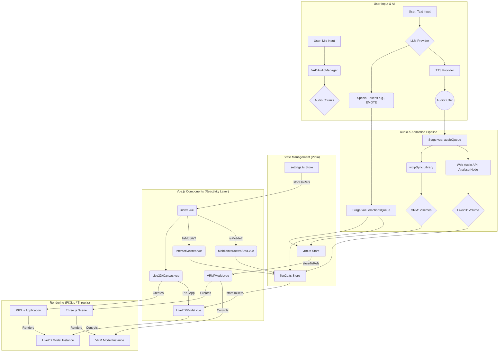

### Airi Project Architecture: A Detailed Research Report

This report provides a comprehensive analysis of the Airi project's architecture, focusing on five key technical areas: Audio-to-Animation Mapping, Performance Optimization, Model Management, State Management Patterns, and Mobile/Responsive Handling.

---

### 1. Audio-to-Animation Mapping

Airi employs a sophisticated, real-time pipeline to convert audio input into expressive animations for both Live2D and VRM models. This system handles microphone input for voice activity detection and synthesized speech for lip-sync and emotional expression.

#### Implementations & Data Flow

*   **Audio Input (Microphone):**
    *   **`apps/stage-web/src/workers/vad/manager.ts`**: The [`VADAudioManager`](apps/stage-web/src/workers/vad/manager.ts:25) class captures microphone input via `navigator.mediaDevices.getUserMedia`.
    *   To avoid blocking the main thread, it offloads voice activity detection (VAD) to an `AudioWorklet` running the `vad-processor`. Processed audio chunks are sent back to the main thread for further handling (e.g., transcription).

*   **Audio Output (TTS & Lip-Sync):**
    *   **Text-to-Speech (TTS) Integration:** In [`packages/stage-ui/src/components/Scenes/Stage.vue`](packages/stage-ui/src/components/Scenes/Stage.vue), the [`handleSpeechGeneration`](packages/stage-ui/src/components/Scenes/Stage.vue:84) function processes text from the LLM, generates audio using a TTS provider, and places the resulting `AudioBuffer` into an [`audioQueue`](packages/stage-ui/src/components/Scenes/Stage.vue:56).
    *   **Live2D Lip-Sync (Volume-Based):**
        *   An `AnalyserNode` ([`audioAnalyser`](packages/stage-ui/src/components/Scenes/Stage.vue:52)) is connected to the audio output.
        *   On each animation frame, [`getVolumeWithMinMaxNormalizeWithFrameUpdates`](packages/stage-ui/src/components/Scenes/Stage.vue:168) calculates the real-time volume from the analyser.
        *   This volume is normalized and passed as the [`mouthOpenSize`](packages/stage-ui/src/components/Scenes/Live2D/Model.vue:29) prop to the [`Live2DModel`](packages/stage-ui/src/components/Scenes/Live2D/Model.vue) component, which directly sets the `ParamMouthOpenY` parameter on the core Live2D model.
    *   **VRM Lip-Sync (Viseme-Based):**
        *   **[`packages/stage-ui/src/composables/vrm/lip-sync.ts`](packages/stage-ui/src/composables/vrm/lip-sync.ts):** The [`useVRMLipSync`](packages/stage-ui/src/composables/vrm/lip-sync.ts:12) composable utilizes the `wLipSync` library for more accurate, viseme-based lip-syncing.
        *   It creates a `wLipSyncNode` that analyzes the audio and produces viseme weights.
        *   The `update` function ([`L28`](packages/stage-ui/src/composables/vrm/lip-sync.ts:28)) maps these weights to the VRM's expression manager using a predefined [`lipSyncMap`](packages/stage-ui/src/composables/vrm/lip-sync.ts:17) (e.g., mapping viseme 'A' to the 'aa' expression).

*   **Emotion & Animation Triggering:**
    *   The LLM can embed special tokens (e.g., `<|EMOTE_HAPPY|>`) in its response.
    *   In [`Stage.vue`](packages/stage-ui/src/components/Scenes/Stage.vue), the [`onTokenSpecial`](packages/stage-ui/src/components/Scenes/Stage.vue:202) function parses these tokens and enqueues them into an [`emotionsQueue`](packages/stage-ui/src/components/Scenes/Stage.vue:139).
    *   This queue triggers corresponding animations by calling the [`setMotion`](packages/stage-ui/src/components/Scenes/Live2D/Model.vue:254) method on the Live2D model or setting expressions on the VRM model.

---

### 2. Performance Optimization

Airi incorporates several key strategies to ensure smooth animation and rendering, manage resources effectively, and maintain a responsive user interface, particularly when dealing with the continuous updates required by the PIXI.js render loop.

#### Implementations

*   **Render Loop Management:**
    *   **[`packages/stage-ui/src/components/Scenes/Live2D/Model.vue`](packages/stage-ui/src/components/Scenes/Live2D/Model.vue):** The component watches a `paused` prop ([`L297`](packages/stage-ui/src/components/Scenes/Live2D/Model.vue:297)). When `true`, it calls `pixiApp.value.stop()` to halt the entire PIXI.js `Ticker`, effectively pausing all rendering and significantly reducing CPU/GPU load.
*   **Efficient Animation Updates:**
    *   **[`packages/stage-ui/src/composables/live2d/animation.ts`](packages/stage-ui/src/composables/live2d/animation.ts):** The [`useLive2DIdleEyeFocus`](packages/stage-ui/src/composables/live2d/animation.ts:12) composable only updates eye and head parameters when the model is idle, preventing unnecessary calculations during active motions.
    *   **[`packages/stage-ui/src/components/Scenes/Live2D/Model.vue`](packages/stage-ui/src/components/Scenes/Live2D/Model.vue):** A "hacky" but effective workaround ([`L199-L239`](packages/stage-ui/src/components/Scenes/Live2D/Model.vue:199)) is implemented to ensure eye blinks continue naturally even during other animations. It hooks into the `motionManager.update` function and manually calls `internalModel.eyeBlink.updateParameters` when the model is otherwise idle, overcoming a limitation in the `pixi-live2d-display` library.
*   **Immediate Motion Transitions:**
    *   To prevent animation delays or frame skipping, new motions are started with `MotionPriority.FORCE` in the [`setMotion`](packages/stage-ui/src/components/Scenes/Live2D/Model.vue:254) function. This forcefully overrides any currently playing motion.
*   **Resource Management:**
    *   **[`packages/stage-ui/src/components/Scenes/Live2D/Model.vue`](packages/stage-ui/src/components/Scenes/Live2D/Model.vue):** When a new model is loaded, the old one is explicitly removed from the stage and destroyed using `model.value.destroy()` ([`L145`](packages/stage-ui/src/components/Scenes/Live2D/Model.vue:145)) to free up memory and WebGL resources.
    *   **[`packages/stage-ui/src/components/Scenes/Live2D/Canvas.vue`](packages/stage-ui/src/components/Scenes/Live2D/Canvas.vue):** The entire PIXI application is destroyed on component unmount (`onUnmounted(() => pixiApp.value?.destroy())` at [`L67`](packages/stage-ui/src/components/Scenes/Live2D/Canvas.vue:67)) to prevent memory leaks.

---

### 3. Model Management

Airi features a flexible system for managing Live2D and VRM models, supporting default models, models loaded from a URL, and user-uploaded files, with a robust fallback mechanism.

#### Type Definitions

*   **[`packages/stage-ui/src/stores/modules/airi-card.ts`](packages/stage-ui/src/stores/modules/airi-card.ts):** The [`AiriExtension`](packages/stage-ui/src/stores/modules/airi-card.ts:13) interface defines the data structure for storing model information within a character card, including the source type (`url`, `file`), path, and other configurations.

#### Implementations

*   **Model State:**
    *   **[`packages/stage-ui/src/stores/live2d.ts`](packages/stage-ui/src/stores/live2d.ts):** This Pinia store centralizes model-related state.
        *   [`defaultModelUrl`](packages/stage-ui/src/stores/live2d.ts:8): A fallback model.
        *   [`modelUrl`](packages/stage-ui/src/stores/live2d.ts:9): A user-configurable URL, persisted in `localStorage`.
        *   [`modelFile`](packages/stage-ui/src/stores/live2d.ts:10): A `computedAsync` property that retrieves a user-uploaded model file from `localforage` (IndexedDB).
*   **Loading Logic:**
    *   **[`packages/stage-ui/src/components/Scenes/Live2D/Model.vue`](packages/stage-ui/src/components/Scenes/Live2D/Model.vue):**
        *   The [`modelSrcNormalized`](packages/stage-ui/src/components/Scenes/Live2D/Model.vue:70) computed property implements the fallback logic, prioritizing the user-uploaded `modelFile` over the `modelUrl`.
        *   The [`loadModel`](packages/stage-ui/src/components/Scenes/Live2D/Model.vue:139) function is triggered when `modelSrcNormalized` changes. It uses `Live2DFactory.setupLive2DModel` to dynamically load the model from the specified source (which can be a URL to a ZIP archive).

---

### 4. State Management Patterns

Airi employs a clean, modern state management architecture that effectively decouples the reactive Vue.js world from the imperative rendering logic of PIXI.js.

#### Implementations

*   **Centralized State (Pinia):**
    *   **[`packages/stage-ui/src/stores/live2d.ts`](packages/stage-ui/src/stores/live2d.ts):** All state related to the Live2D model (e.g., `modelUrl`, `position`, `scale`, `currentMotion`) is defined in a Pinia store. This provides a single source of truth that can be accessed from any component.
*   **Reactivity Bridge (Vue Component):**
    *   **[`packages/stage-ui/src/components/Scenes/Live2D/Model.vue`](packages/stage-ui/src/components/Scenes/Live2D/Model.vue):** This component acts as the bridge.
        *   It uses `storeToRefs` ([`L125`](packages/stage-ui/src/components/Scenes/Live2D/Model.vue:125)) to create reactive references to the state in the Pinia store.
        *   It uses Vue's `watch` and `watchDebounced` functions to observe changes in props (like `mouthOpenSize`) and store state (like `currentMotion`).
        *   The `watch` callbacks contain the imperative logic to update the `Live2DModel` instance. For example, `watch(mouthOpenSize, value => getCoreModel().setParameterValueById('ParamMouthOpenY', value))` ([`L295`](packages/stage-ui/src/components/Scenes/Live2D/Model.vue:295)) directly manipulates the underlying PIXI object in response to a reactive state change.
*   **Rendering Host (Vue Component):**
    *   **[`packages/stage-ui/src/components/Scenes/Live2D/Canvas.vue`](packages/stage-ui/src/components/Scenes/Live2D/Canvas.vue):** This component's sole responsibility is to initialize the PIXI `Application` ([`initLive2DPixiStage`](packages/stage-ui/src/components/Scenes/Live2D/Canvas.vue:22)) and provide a slot for its children, passing the `app` instance down. This cleanly separates the PIXI setup from the model's logic.

This pattern allows the UI controls (e.g., sliders for position/scale) to simply mutate the Pinia store, and the `Model.vue` component ensures the PIXI.js representation automatically synchronizes.

---

### 5. Mobile & Responsive Handling

Airi implements a robust responsive design that provides a tailored experience for both desktop and mobile devices by swapping entire component layouts and adapting styles.

#### Implementations

*   **Breakpoint Detection:**
    *   **[`apps/stage-web/src/pages/index.vue`](apps/stage-web/src/pages/index.vue):** The `useBreakpoints(breakpointsTailwind)` composable from `@vueuse/core` is used to create an `isMobile` computed property ([`L27`](apps/stage-web/src/pages/index.vue:27)) that returns `true` for screens smaller than the `md` Tailwind CSS breakpoint.
*   **Conditional Layouts:**
    *   The `isMobile` flag is used in `v-if` directives to conditionally render different components for the main interactive area:
        *   `v-if="!isMobile"` renders [`<InteractiveArea />`](apps/stage-web/src/pages/index.vue:61), the desktop layout.
        *   `v-if="isMobile"` renders [`<MobileInteractiveArea />`](apps/stage-web/src/pages/index.vue:62), the mobile layout.
*   **Tailored Components:**
    *   **[`apps/stage-web/src/components/Layouts/InteractiveArea.vue`](apps/stage-web/src/components/Layouts/InteractiveArea.vue):** The desktop version features a wide layout with a prominent chat history.
    *   **[`apps/stage-web/src/components/Layouts/MobileInteractiveArea.vue`](apps/stage-web/src/components/Layouts/MobileInteractiveArea.vue):** The mobile version is heavily optimized for touch:
        *   It uses `fixed bottom-0` ([`L117`](apps/stage-web/src/components/Layouts/MobileInteractiveArea.vue:117)) to anchor the UI to the bottom of the screen.
        *   It uses `useScreenSafeArea` ([`L27`](apps/stage-web/src/components/Layouts/MobileInteractiveArea.vue:27)) to dynamically add padding, avoiding overlap with mobile OS UI elements (notches, home indicators).
        *   Controls are laid out vertically for easy one-handed access.
*   **Adaptive Model Rendering:**
    *   **[`packages/stage-ui/src/components/Scenes/Live2D/Model.vue`](packages/stage-ui/src/components/Scenes/Live2D/Model.vue):** The `isMobile` flag is also used internally to adjust model scaling logic in the `setScaleAndPosition` function ([`L111`](packages/stage-ui/src/components/Scenes/Live2D/Model.vue:111)).
    *   **[`apps/stage-web/src/pages/index.vue`](apps/stage-web/src/pages/index.vue):** The `x-offset` of the model is conditionally changed for mobile screens to ensure it is positioned correctly within the different layout ([`L57`](apps/stage-web/src/pages/index.vue:57)).

---

### Architectural Diagram (Mermaid)

