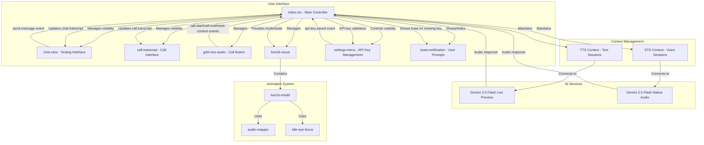

# Technical Design: Dual-Input Mode

## 1. Overview
This document outlines the technical design for a dual-input mode that simulates a realistic messaging/calling experience. The system maintains separate conversation contexts for texting (TTS flow) and calling (STS flow), with dynamic UI components that appear based on the active mode. The design features a messaging app interface with a persistent chat window for texting and a dynamically appearing call transcript window during voice calls. The Live2D model animates consistently across both modes.

## 2. Architecture
The architecture implements a dual-context system with separate conversation histories for texting (TTS) and calling (STS) modes. The main application manages two independent AI sessions with lazy initialization - sessions are only created when the user actually interacts (sends first message or starts a call). The system dynamically shows/hides transcript windows based on the active mode. The interface simulates a messaging app with persistent texting on the left and call functionality on the right, both maintaining consistent 400px widths to preserve the Live2D model viewing area.

The application now lands directly on the main UI instead of using the settings menu as a landing page. API key validation is performed on-demand when users attempt to use TTS or STS features. If no API key is configured, the settings menu opens automatically with a toast notification prompting the user to enter their API key.

The layout uses a three-column approach: chat transcript (400px, left), Live2D model (flexible center), and call transcript (400px, right when active). This ensures optimal readability while maintaining the immersive character experience.



## 3. Components and Interfaces

### 3.1. `index.tsx` (Main Application)
- **Responsibility:**
    - Manage dual-context system with separate TTS and STS conversation histories.
    - Control visibility of chat-view and call-transcript components based on active mode.
    - Handle session lifecycle events for both texting and calling modes.
    - Provide the `outputNode` from active AI session to the `live2d-visual` component.
    - Manage settings menu visibility and API key validation.
    - Show toast notifications when API key is missing.
- **State:**
    - `activeMode: 'texting' | 'calling' | null`
    - `textTranscript: Turn[]` - Persistent texting conversation history
    - `callTranscript: Turn[]` - Persistent calling conversation history
    - `textSession: Session | null` - Active TTS session
    - `callSession: Session | null` - Active STS session
    - `outputNode: AudioNode | null`
    - `showSettings: boolean` - Controls settings menu visibility
    - `showToast: boolean` - Controls toast notification visibility
    - `toastMessage: string` - Toast notification text
- **Methods:**
    - `_handleSendMessage(e: CustomEvent)`: Validates API key, shows settings/toast if missing, then lazily initiates TTS session and sends message.
    - `_handleCallStart()`: Validates API key, shows settings/toast if missing, then lazily initiates STS session and shows call transcript.
    - `_handleCallEnd()`: Ends STS session and shows chat view.
    - `_handleResetContext()`: Handles reset-context event from unified call/reset button, always resets call context only.
    - `_resetTextContext()`: Clears text transcript and closes text session.
    - `_resetCallContext()`: Clears call transcript and closes call session.
    - `_initTextSession()`: Connects to `gemini-2.5-flash-live-preview` (called only when first message is sent).
    - `_initCallSession()`: Connects to `gemini-2.5-flash-exp-native-audio-thinking-dialog` (called only when call starts).
    - `_checkApiKeyExists()`: Checks if API key is present (not empty), returns boolean.
    - `_showApiKeyPrompt()`: Opens settings menu and shows toast prompting for API key.
    - `_handleApiKeySaved()`: Closes settings menu and toast when API key is saved.

### 3.2. `chat-view.ts` (Texting Interface)
- **Responsibility:**
    - Display the texting conversation transcript (always visible when not calling).
    - Provide text input field and send button for messaging simulation.
    - Emit `send-message` event when user sends a text message.
- **Properties:**
    - `transcript: Turn[]` - The text conversation history
    - `visible: boolean` - Controls visibility (hidden during calls)
- **Events:**
    - `send-message`: Dispatched with message text as detail.

### 3.3. `call-transcript.ts` (Call Interface)
- **Responsibility:**
    - Display real-time call transcript (only visible during active calls).
    - Show transcribed conversation from voice interactions.
    - Automatically appear when call starts, disappear when call ends.
- **Properties:**
    - `transcript: Turn[]` - The call conversation history
    - `visible: boolean` - Controls visibility (only shown during calls)

### 3.4. `gdm-live-audio` (Unified Call/Reset Button)
- **Responsibility:**
    - Provide a "Call" button to start and end voice calls (not "Record").
    - Act as a reset button when long pressed (1+ seconds) with enhanced visual feedback.
    - Manage call state and emit appropriate events for both call and reset actions.
    - Display progressive visual indicators during long press to clearly communicate reset intent.
- **Properties:**
    - `isCallActive: boolean` - Whether a call is currently active
- **State:**
    - `_longPressTimer: number | null` - Timer for tracking long press duration
    - `_isLongPressing: boolean` - Flag to track if long press is in progress
    - `_showLongPressVisual: boolean` - Controls visual feedback during long press
    - `_longPressProgress: number` - Progress value (0-1) for circular progress indicator
- **Events:**
    - `call-start`: Dispatched when call begins (normal click).
    - `call-end`: Dispatched when call ends (normal click).
    - `reset-context`: Dispatched when long press (1+ seconds) is detected.
- **Methods:**
    - `_handleMouseDown()` / `_handleTouchStart()`: Start long press timer and visual feedback.
    - `_handleMouseUp()` / `_handleTouchEnd()`: Handle normal click or long press completion.
    - `_handleLongPress()`: Emit reset-context event after 1 second with confirmation flash.
    - `_clearLongPressTimer()`: Clean up timer and reset long press state.
    - `_updateProgressIndicator()`: Updates circular progress indicator during long press.
    - `_triggerResetConfirmation()`: Brief flash/pulse animation when reset is triggered.

### 3.4. `live2d-visual`
- **Responsibility:**
    - The main entry point for the Live2D visualization.
    - Wraps the `live2d-canvas` and `live2d-model` components.
- **Properties:**
    - `modelUrl: string`
    - `outputNode: AudioNode`

### 3.5. `live2d-model`
- **Responsibility:**
    - Loads the Live2D model.
    - Manages the animation loop.
    - Initializes and uses `AudioToAnimationMapper` and `IdleEyeFocus`.
- **Properties:**
    - `outputNode: AudioNode`

### 3.6. `audio-mapper.ts`
- **Responsibility:**
    - Analyzes the `outputNode` to drive lip-sync animations.
- **Methods:**
    - `update()`: Calculates the current audio level.
    - `get mouthOpen()`: Returns the smoothed audio level.

### 3.7. `idle-eye-focus.ts`
- **Responsibility:**
    - Manages idle animations (blinking, eye movement).
- **Methods:**
    - `update(dt)`: Updates idle parameters.

### 3.8. `settings-menu` (API Key Management)
- **Responsibility:**
    - Provide interface for entering and saving Gemini API key.
    - Show/hide based on API key validation requirements or manual access.
    - Validate API key format and provide visual feedback.
    - Support clipboard pasting and external API key link.
    - Emit events when API key is saved successfully.
- **Properties:**
    - `visible: boolean` - Controls visibility (shown when API key missing or manually opened)
    - `apiKey: string` - Current API key value
- **State:**
    - `_error: string` - Current validation error message
    - `_isSaving: boolean` - Loading state during save operations
- **Events:**
    - `api-key-saved`: Dispatched when user saves a valid API key.
- **Methods:**
    - `_onApiKeyInput(e: Event)`: Updates apiKey property and clears validation errors.
    - `_validateApiKey(key: string): boolean`: Validates API key format (starts with "AIzaSy", 39 characters total).
    - `_onSave()`: Validates key, saves to localStorage, and emits `api-key-saved` event.
    - `_onPaste()`: Reads from clipboard using Clipboard API and populates input field.
    - `_getApiKeyUrl()`: Opens "https://aistudio.google.com/apikey" in new tab.
    - `_handleCancel()`: Closes settings menu without saving.

### 3.9. `toast-notification` (User Prompts)
- **Responsibility:**
    - Display temporary notification messages to guide user actions.
    - Show API key prompts when validation fails.
    - Auto-hide after user completes required actions.
- **Properties:**
    - `visible: boolean` - Controls visibility
    - `message: string` - Toast notification text
    - `type: 'info' | 'warning' | 'error'` - Toast styling type
- **Methods:**
    - `show(message: string, type?: string)`: Display toast with message.
    - `hide()`: Hide toast notification.

## 4. Session Lifecycle Management

### 4.1. Lazy Initialization Pattern
To conserve API usage and resources, AI sessions are initialized only when needed:

- **TTS Session**: Created when user sends their first text message. The `_handleSendMessage` method first validates the API key, then checks if `textSession` is null and calls `_initTextSession()` before sending the message.
- **STS Session**: Created when user clicks the "Call" button. The `_handleCallStart` method first validates the API key, then calls `_initCallSession()` as part of the call initiation process.
- **App Startup**: No sessions are created during application initialization. The app starts with `textSession: null` and `callSession: null`. The main UI is displayed immediately.

### 4.2. API Key Presence Check Flow
Before any session initialization, the system checks that an API key is configured:

1. **User Action**: User attempts to send message or start call
2. **Presence Check**: `_checkApiKeyExists()` checks if API key is present (not empty)
3. **Success Path**: If API key exists, proceed with session initialization
4. **Missing Key Path**: If no API key, call `_showApiKeyPrompt()` which:
   - Sets `showSettings: true` to display settings menu
   - Sets `showToast: true` with message "Please enter your Gemini API key to start chatting"
   - Blocks the intended action until API key is provided
5. **Resolution**: When user saves API key (settings menu handles validation), `_handleApiKeySaved()` closes settings and toast, allowing the original action to proceed

### 4.3. Session State Management
- Sessions remain active until explicitly closed (via reset or app termination)
- Switching between modes preserves both sessions if they exist
- Each session maintains its own conversation history independently
- API key validation occurs before each new session creation, not during mode switching

## 5. Data Models

```typescript
interface Turn {
  text: string;
  author: 'user' | 'model';
  timestamp?: Date;
}

interface DualContext {
  textTranscript: Turn[];
  callTranscript: Turn[];
  textSession: Session | null;
  callSession: Session | null;
}

type ActiveMode = 'texting' | 'calling' | null;

interface ToastState {
  visible: boolean;
  message: string;
  type: 'info' | 'warning' | 'error';
}

interface SettingsState {
  visible: boolean;
  apiKey: string;
}
```

## 5. Error Handling
- **Session Initialization Errors:** If a TTS or STS model fails to connect, display mode-specific error messages without affecting the other context.
- **Context Preservation:** If one session fails, the other context remains intact and accessible.
- **Call Interruption:** If a call is interrupted, gracefully return to texting mode while preserving both conversation histories.
- **UI State Recovery:** Ensure transcript windows return to correct visibility states after any errors.

## 6. Testing Strategy
- **Unit Tests:**
    - Test dual-context state management logic in `index.tsx` (separate TTS/STS contexts).
    - Test transcript window visibility logic based on active mode.
    - Test event emission in `chat-view`, `call-transcript`, and `gdm-live-audio`.
    - Test context preservation when switching between modes.
    - Test audio analysis in `audio-mapper.ts`.
- **Integration Tests:**
    - Test communication between main application and dynamic transcript components.
    - Test the connection between active session `outputNode` and `live2d-visual`.
    - Test proper hiding/showing of chat-view and call-transcript components.
- **End-to-End (E2E) Tests:**
    - Simulate full texting flow (TTS) with chat window visibility.
    - Simulate full calling flow (STS) with call transcript window visibility.
    - Test context switching between texting and calling modes.
    - Test context preservation across mode switches.
    - Mock AI services to provide predictable responses for both modes.
    - Visually verify model animates correctly for both TTS and STS audio.