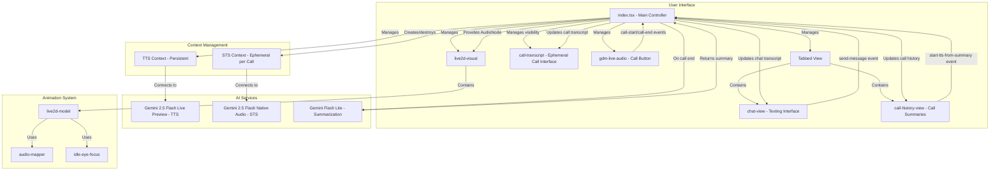

# Technical Design: Dual-Input Mode

> **Note:** This document outlines the complete technical design. The initial implementation phase focuses on building the UI scaffolding; the backend logic and session management are pending.

## 1. Overview
This document outlines the technical design for a dual-input mode that simulates a realistic messaging/calling experience. The system supports two distinct interaction flows: a persistent text-based chat (TTS) and a stateless voice call (STS). Each voice call starts with a fresh context, and upon completion, the transcript is summarized and stored in a "Call History" tab. The UI is structured with a main tabbed component on the left for switching between the live chat and call history, ensuring a clean and organized user experience.

## 2. Architecture
The architecture is designed around a stateful text chat context and stateless, ephemeral voice call sessions. The main application controller manages the state for the text transcript and a history of call summaries. When a voice call is initiated, a new STS session is created and is terminated upon call completion. The call transcript is then passed to a summarization service, and the result is stored. This approach simplifies state management by avoiding the need to maintain a persistent call session.

The UI will feature a primary tabbed view on the left, allowing users to switch between the ongoing "Chat" and the "Call History". This keeps the interface clean and separates concerns effectively.

### Design Rationale (Post-Research)
The research confirms that the application's architecture is well-suited for these new features. Key takeaways include:
- **Centralized State Management:** The main `GdmLiveAudio` component in `index.tsx` already manages application state. We will extend this to include `activeTab` and `callHistory`.
- **Component-Based UI:** New UI elements (`TabView`, `CallHistoryView`) will be created as Lit components, following the pattern of existing components like `chat-view.ts`.
- **Service Abstraction:** The new `SummarizationService` will be modeled after the existing `TextSessionManager` and `CallSessionManager`, encapsulating its logic and promoting separation of concerns.



## 3. Components and Interfaces

### 3.1. `gdm-live-audio` in `index.tsx` (Main Orchestrator)
- **Responsibility:**
    - Extend its role as the central state manager to handle `activeTab` and `callHistory`.
    - Control the visibility of the ephemeral `call-transcript` component.
    - Handle the lifecycle of STS sessions (create on call start, destroy on call end).
    - Orchestrate the call summarization flow.
    - Manage the active tab state (`chat` or `call-history`).
- **State (New and Modified):**
    - `@state() activeTab: 'chat' | 'call-history' = 'chat'`
    - `@state() callHistory: CallSummary[] = []`
    - `@state() isCallActive: boolean` (Existing, but will now control visibility of the ephemeral call transcript)
- **Methods (New and Modified):**
    - `_handleCallEnd()`: Now orchestrates the summarization flow by calling the `SummarizationService`.
    - `_handleSummarizationComplete(summary: CallSummary)`: Appends the new summary to the `callHistory` state array.
    - `_handleTabSwitch(e: CustomEvent)`: Updates the `activeTab` state, causing the view to re-render with the correct content.
    - `_startTtsFromSummary(e: CustomEvent)`: Clears the `textTranscript` and initiates a new TTS session seeded with the call summary content.

### 3.2. `tab-view.ts` (Tab Host)
- **Responsibility:**
    - Render "Chat" and "Call History" tabs.
    - Display the content of the active tab.
    - Emit `tab-switch` event when the user changes tabs.
- **Properties:**
    - `activeTab: 'chat' | 'call-history'`
- **Events:**
    - `tab-switch`: Dispatched with the selected tab name.

### 3.3. `chat-view.ts` (Texting Interface)
- **Responsibility:**
    - Display the persistent texting conversation transcript.
    - Provide text input and send button.
    - Emit `send-message` event.
- **Properties:**
    - `transcript: Turn[]`
- **Events:**
    - `send-message`: Dispatched with message text.

### 3.4. `call-history-view.ts` (Call History)
- **Responsibility:**
    - Display the list of call summaries.
    - Allow a user to click on a summary to start a new chat.
- **Properties:**
    - `history: CallSummary[]`
- **Events:**
    - `start-tts-from-summary`: Dispatched with the summary content.

### 3.5. `call-transcript.ts` (Ephemeral Call Interface)
- **Responsibility:**
    - Display the real-time transcript for the *currently active* call.
    - This component is temporary and only visible during a call.
- **Properties:**
    - `transcript: Turn[]` - The current call's conversation history.
    - `visible: boolean`

### 3.6. `controls-panel.ts` (Control Buttons)
- **Responsibility:**
    - Provide unified control interface with settings, scroll-to-bottom, call start/end buttons.
    - Manage button states and visual feedback.
    - Emit control events to parent component.
- **Properties:**
    - `isCallActive: boolean`
    - `showScrollToBottom: boolean`
    - `newMessageCount: number`
- **Events:**
    - `toggle-settings`: Opens/closes settings menu
    - `scroll-to-bottom`: Scrolls call transcript to bottom
    - `call-start`: Dispatched when a call begins
    - `call-end`: Dispatched when a call ends

### 3.7. Real-time Transcription System
- **CallSessionManager:** Enhanced with bidirectional transcription support
    - `outputAudioTranscription: {}` - Captures model speech transcription
    - `inputAudioTranscription: {}` - Captures user speech transcription
    - Real-time transcript updates via callback system
- **TextSessionManager:** Handles text-to-speech with transcript capture
    - Extracts text from model responses for chat transcript
    - Manages persistent text conversation context

## 4. Session Lifecycle Management

### 4.1. Session and Summarization Flow
- **TTS Session**: Persists and is lazily initialized on the first text message.
- **STS Session**: Ephemeral. It is created when a call starts and destroyed when it ends.
- **Summarization**: On `call-end`, the `currentCallTranscript` is sent to a `SummarizationService`. This service makes a one-off call to the `gemini-1.5-flash-latest` model. The resulting summary is added to the `callHistory`.

### 4.2. State Management
- The `textTranscript` is preserved across the application's lifecycle.
- The `callHistory` is preserved and grows as calls are completed and summarized.
- The `currentCallTranscript` is cleared after each call.

## 5. Data Models
```typescript
interface Turn {
  text: string;
  author: 'user' | 'model';
  timestamp?: Date;
}

interface CallSummary {
  id: string;
  summaryText: string;
  fullTranscript: Turn[];
  timestamp: Date;
}

interface AppState {
  textTranscript: Turn[];
  callHistory: CallSummary[];
  textSession: Session | null;
  activeTab: 'chat' | 'call-history';
}
```

## 6. Call Summarization Service
A new stateless service will be created to handle call summarization.

```typescript
class SummarizationService {
  private client: GoogleGenerativeAI;

  constructor() {
    this.client = new GoogleGenerativeAI(import.meta.env.VITE_API_KEY);
  }

  /**
   * Follows the existing service abstraction pattern.
   * This service is stateless and makes a non-streaming call to the API.
   */
  async summarize(transcript: Turn[]): Promise<string> {
    const model = this.client.getGenerativeModel({ model: "gemini-flash-lite" });
    const prompt = `Summarize the following conversation:\n\n${transcript.map(t => `${t.author}: ${t.text}`).join('\n')}`;
    
    try {
      const result = await model.generateContent(prompt);
      return result.response.text();
    } catch (e) {
      console.error("Summarization failed:", e);
      return "Summary unavailable.";
    }
  }
}
```

## 7. Auto-scroll Transcript System
A generic auto-scroll utility provides consistent scrolling behavior across all transcript components.

```typescript
class TranscriptAutoScroll {
  shouldAutoScroll(element: Element): boolean;
  scrollToBottom(element: Element, smooth?: boolean): void;
  handleTranscriptUpdate(element: Element, oldLength: number, newLength: number): void;
  handleVisibilityChange(element: Element, isVisible: boolean, hasContent: boolean): void;
  getScrollToBottomState(element: Element, currentMessageCount: number, lastSeenMessageCount: number): ScrollToBottomState;
  handleScrollEvent(element: Element): boolean;
}

interface ScrollToBottomState {
  showButton: boolean;
  newMessageCount: number;
}
```

### 7.1. Smart Auto-scroll Logic
- **User-Aware Scrolling:** Only auto-scrolls when user is at or near the bottom (within 50px threshold)
- **Performance Optimization:** Uses `requestAnimationFrame` for proper DOM timing when scrolling occurs
- **Rapid Update Handling:** Detects multiple quick updates and uses instant scrolling to avoid excessive animation
- **Smooth Scrolling:** Applies smooth scroll behavior for single message updates
- **First Message Handling:** Always scrolls to show the first message in an empty transcript
- **State Tracking:** Uses WeakMap to track scroll state before DOM updates to eliminate timing issues

### 7.2. Component Integration
- **chat-view.ts:** Uses generic auto-scroll for text messaging transcript
- **call-transcript.ts:** Uses generic auto-scroll for voice call transcript
- **Visibility Handling:** Automatically scrolls to bottom when transcript components become visible
- **Height Constraints:** Fixed height containers (`calc(100vh - 120px)`) ensure proper scrollable areas

### 7.3. Scroll-to-Bottom Button System
- **Smart Visibility:** Button appears when user scrolls away from bottom during calls
- **Message Counter:** Shows count of new messages received while scrolled away
- **Squircle Design:** Matches call button styling with consistent visual language
- **Event Communication:** Uses custom events to communicate scroll state between components

## 8. Error Handling
- **Session Initialization Errors:** If a TTS or STS model fails to connect, display a toast notification.
- **Summarization Errors:** If the summarization service fails, a "Summary unavailable" message will be stored in the call history.
- **UI State Recovery:** Ensure the UI correctly returns to the tabbed chat view after a call ends, even if summarization fails.
- **Layout Constraints:** Main container uses `overflow: hidden` to prevent page scrolling and maintain proper component boundaries.

## 8. Testing Strategy
- **Unit Tests:**
    - Test the extended state management logic in `gdm-live-audio` (`activeTab`, `callHistory`).
    - Test the `SummarizationService` by mocking the `@google/genai` client.
    - Create tests for the new Lit components: `tab-view` and `call-history-view`.
- **Integration Tests:**
    - Verify that the `gdm-live-audio` component correctly passes state down to `tab-view` and `call-history-view`.
    - Test the full data flow: `call-end` event -> `SummarizationService` -> `callHistory` state update -> `call-history-view` re-render.
- **End-to-End (E2E) Tests:**
    - Simulate a full user journey: start a call, end it, switch to the "Call History" tab, and verify the summary is present.
    - Test starting a new TTS session from a call summary in the history view.