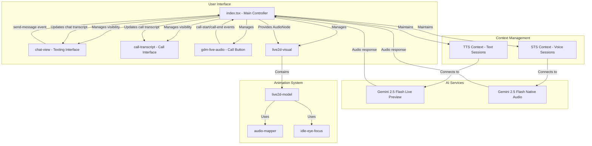

# Technical Design: Dual-Input Mode

## 1. Overview
This document outlines the technical design for a dual-input mode that simulates a realistic messaging/calling experience. The system maintains separate conversation contexts for texting (TTS flow) and calling (STS flow), with dynamic UI components that appear based on the active mode. The design features a messaging app interface with a persistent chat window for texting and a dynamically appearing call transcript window during voice calls. The Live2D model animates consistently across both modes.

## 2. Architecture
The architecture implements a dual-context system with separate conversation histories for texting (TTS) and calling (STS) modes. The main application manages two independent AI sessions and dynamically shows/hides transcript windows based on the active mode. The interface simulates a messaging app with persistent texting on the left and call functionality.



## 3. Components and Interfaces

### 3.1. `index.tsx` (Main Application)
- **Responsibility:**
    - Manage dual-context system with separate TTS and STS conversation histories.
    - Control visibility of chat-view and call-transcript components based on active mode.
    - Handle session lifecycle events for both texting and calling modes.
    - Provide the `outputNode` from active AI session to the `live2d-visual` component.
- **State:**
    - `activeMode: 'texting' | 'calling' | null`
    - `textTranscript: Turn[]` - Persistent texting conversation history
    - `callTranscript: Turn[]` - Persistent calling conversation history
    - `textSession: Session | null` - Active TTS session
    - `callSession: Session | null` - Active STS session
    - `outputNode: AudioNode | null`
- **Methods:**
    - `_handleSendMessage(e: CustomEvent)`: Initiates or sends message to TTS session.
    - `_handleCallStart()`: Initiates STS session and shows call transcript.
    - `_handleCallEnd()`: Ends STS session and shows chat view.
    - `_initTextSession()`: Connects to `gemini-2.5-flash-live-preview`.
    - `_initCallSession()`: Connects to `gemini-2.5-flash-exp-native-audio-thinking-dialog`.

### 3.2. `chat-view.ts` (Texting Interface)
- **Responsibility:**
    - Display the texting conversation transcript (always visible when not calling).
    - Provide text input field and send button for messaging simulation.
    - Emit `send-message` event when user sends a text message.
- **Properties:**
    - `transcript: Turn[]` - The text conversation history
    - `visible: boolean` - Controls visibility (hidden during calls)
- **Events:**
    - `send-message`: Dispatched with message text as detail.

### 3.3. `call-transcript.ts` (Call Interface)
- **Responsibility:**
    - Display real-time call transcript (only visible during active calls).
    - Show transcribed conversation from voice interactions.
    - Automatically appear when call starts, disappear when call ends.
- **Properties:**
    - `transcript: Turn[]` - The call conversation history
    - `visible: boolean` - Controls visibility (only shown during calls)

### 3.4. `gdm-live-audio` (Call Button)
- **Responsibility:**
    - Provide a "Call" button to start and end voice calls (not "Record").
    - Manage call state and emit appropriate events.
- **Properties:**
    - `isCallActive: boolean` - Whether a call is currently active
- **Events:**
    - `call-start`: Dispatched when call begins.
    - `call-end`: Dispatched when call ends.

### 3.4. `live2d-visual`
- **Responsibility:**
    - The main entry point for the Live2D visualization.
    - Wraps the `live2d-canvas` and `live2d-model` components.
- **Properties:**
    - `modelUrl: string`
    - `outputNode: AudioNode`

### 3.5. `live2d-model`
- **Responsibility:**
    - Loads the Live2D model.
    - Manages the animation loop.
    - Initializes and uses `AudioToAnimationMapper` and `IdleEyeFocus`.
- **Properties:**
    - `outputNode: AudioNode`

### 3.6. `audio-mapper.ts`
- **Responsibility:**
    - Analyzes the `outputNode` to drive lip-sync animations.
- **Methods:**
    - `update()`: Calculates the current audio level.
    - `get mouthOpen()`: Returns the smoothed audio level.

### 3.7. `idle-eye-focus.ts`
- **Responsibility:**
    - Manages idle animations (blinking, eye movement).
- **Methods:**
    - `update(dt)`: Updates idle parameters.

## 4. Data Models

```typescript
interface Turn {
  text: string;
  author: 'user' | 'model';
  timestamp?: Date;
}

interface DualContext {
  textTranscript: Turn[];
  callTranscript: Turn[];
  textSession: Session | null;
  callSession: Session | null;
}

type ActiveMode = 'texting' | 'calling' | null;
```

## 5. Error Handling
- **Session Initialization Errors:** If a TTS or STS model fails to connect, display mode-specific error messages without affecting the other context.
- **Context Preservation:** If one session fails, the other context remains intact and accessible.
- **Call Interruption:** If a call is interrupted, gracefully return to texting mode while preserving both conversation histories.
- **UI State Recovery:** Ensure transcript windows return to correct visibility states after any errors.

## 6. Testing Strategy
- **Unit Tests:**
    - Test dual-context state management logic in `index.tsx` (separate TTS/STS contexts).
    - Test transcript window visibility logic based on active mode.
    - Test event emission in `chat-view`, `call-transcript`, and `gdm-live-audio`.
    - Test context preservation when switching between modes.
    - Test audio analysis in `audio-mapper.ts`.
- **Integration Tests:**
    - Test communication between main application and dynamic transcript components.
    - Test the connection between active session `outputNode` and `live2d-visual`.
    - Test proper hiding/showing of chat-view and call-transcript components.
- **End-to-End (E2E) Tests:**
    - Simulate full texting flow (TTS) with chat window visibility.
    - Simulate full calling flow (STS) with call transcript window visibility.
    - Test context switching between texting and calling modes.
    - Test context preservation across mode switches.
    - Mock AI services to provide predictable responses for both modes.
    - Visually verify model animates correctly for both TTS and STS audio.