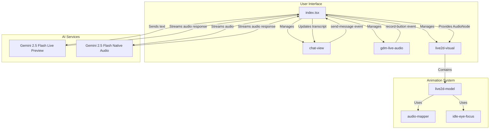

# Technical Design: Dual-Input Mode

## 1. Overview
This document outlines the technical design for a dual-input mode, allowing users to interact with the application via text or voice. The design centers on a state management system that conditionally loads the appropriate generative model (`gemini-2.5-flash-live-preview` for text, `gemini-2.5-flash-exp-native-audio-thinking-dialog` for audio) and dynamically adjusts the UI to match the user's chosen interaction method. The Live2D model will be animated in response to both text and voice interactions, with lip-syncing and idle animations.

## 2. Architecture
The architecture is designed to be modular and event-driven. The main application component (`index.tsx`) will act as a controller, managing the active session and UI state. The `chat-view`, `gdm-live-audio`, and `live2d-visual` components will handle their respective UI elements and emit events to the main component.



## 3. Components and Interfaces

### 3.1. `index.tsx` (Main Application)
- **Responsibility:**
    - Manage the overall application state (`activeSession`, `transcript`).
    - Conditionally initialize the appropriate AI model based on user actions.
    - Handle session lifecycle events (start, stop, error).
    - Mediate communication between `chat-view` and `gdm-live-audio`.
    - Provide the `outputNode` from the AI session to the `live2d-visual` component.
- **State:**
    - `activeSession: 'text' | 'voice' | null`
    - `transcript: Turn[]`
    - `outputNode: AudioNode | null`
- **Methods:**
    - `_handleSendMessage(e: CustomEvent)`: Initiates or sends a message to a text session.
    - `_handleRecord()`: Initiates a voice session.
    - `_initTextSession()`: Connects to `gemini-2.5-flash-live-preview`.
    - `_initVoiceSession()`: Connects to `gemini-2.5-flash-exp-native-audio-thinking-dialog`.

### 3.2. `chat-view.ts`
- **Responsibility:**
    - Display the conversation transcript.
    - Provide a text input field and send button.
    - Emit a `send-message` event when the user sends a message.
- **Properties:**
    - `transcript: Turn[]`
- **Events:**
    - `send-message`: Dispatched with the message text as the detail.

### 3.3. `gdm-live-audio`
- **Responsibility:**
    - Provide a record button to start and stop voice input.
- **Events:**
    - `record-start`: Dispatched when recording begins.
    - `record-stop`: Dispatched when recording ends.

### 3.4. `live2d-visual`
- **Responsibility:**
    - The main entry point for the Live2D visualization.
    - Wraps the `live2d-canvas` and `live2d-model` components.
- **Properties:**
    - `modelUrl: string`
    - `outputNode: AudioNode`

### 3.5. `live2d-model`
- **Responsibility:**
    - Loads the Live2D model.
    - Manages the animation loop.
    - Initializes and uses `AudioToAnimationMapper` and `IdleEyeFocus`.
- **Properties:**
    - `outputNode: AudioNode`

### 3.6. `audio-mapper.ts`
- **Responsibility:**
    - Analyzes the `outputNode` to drive lip-sync animations.
- **Methods:**
    - `update()`: Calculates the current audio level.
    - `get mouthOpen()`: Returns the smoothed audio level.

### 3.7. `idle-eye-focus.ts`
- **Responsibility:**
    - Manages idle animations (blinking, eye movement).
- **Methods:**
    - `update(dt)`: Updates idle parameters.

## 4. Data Models

```typescript
interface Turn {
  text: string;
  author: 'user' | 'model';
}
```

## 5. Error Handling
- **Session Initialization Errors:** If a model fails to connect, display a non-intrusive error message to the user (e.g., a toast notification).
- **Invalid State Transitions:** The UI will prevent invalid actions (e.g., trying to send a text message during a voice session) by disabling or hiding the relevant controls.

## 6. Testing Strategy
- **Unit Tests:**
    - Test the state management logic in `index.tsx`.
    - Test the event emission in `chat-view` and `gdm-live-audio`.
    - Test the audio analysis in `audio-mapper.ts`.
- **Integration Tests:**
    - Test the communication between the main application and the child components.
    - Test the connection between the `outputNode` and the `live2d-visual` component.
- **End-to-End (E2E) Tests:**
    - Simulate a full user flow for both text and voice interactions.
    - Mock the AI service to provide predictable responses.
    - Visually verify that the model animates correctly in response to audio.