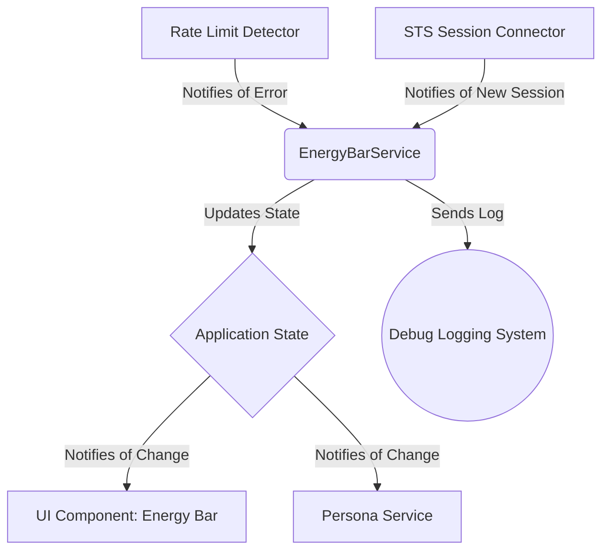

# Technical Design: Energy Bar System

### Overview

This document outlines the technical design for the **Energy Bar System** feature. The goal is to gracefully manage the AI's conversational capabilities by dynamically switching between different Gemini models as rate limits are exhausted. The proposed solution involves creating a new state management service to track the energy level, updating the UI to reflect the current state, and integrating with the existing persona and logging systems. This design ensures the solution is robust, maintainable, and provides clear feedback to the user.

### Architecture

The proposed architecture is based on an event-driven model integrated within the existing application structure. The core of this feature is a new `EnergyBarService` that will act as the single source of truth for the AI's energy state.

**Data Flow:**
1.  The `EnergyBarService` is initialized with a full energy level (3) when the application starts.
2.  An existing `Rate Limit Detector` will notify the `EnergyBarService` when a rate limit error for the current model is encountered.
3.  The `EnergyBarService` decrements the energy level and updates the central `Application State`.
4.  The `STS Session Connector` notifies the `EnergyBarService` when a new call session begins.
5.  The `EnergyBarService` resets the energy level to 3 and updates the `Application State`.
6.  The `UI Component` and `Persona Service` subscribe to state changes and update the visual icon and conversational prompts accordingly.
7.  All state changes within the `EnergyBarService` are logged via the `Debug Logging System`.

### Components and Interfaces

#### 1. EnergyBarService
*   **Responsibility:** Manages the energy level state, including initialization, decrementing, and resetting. It is the central logic hub for this feature.
*   **Interface:**
    *   `getCurrentEnergyLevel(): number`
    *   `handleRateLimitError(): void`
    *   `resetEnergyLevel(): void`

#### 2. UI Component: Energy Bar
*   **Responsibility:** Displays the battery-style icon and handles all visual updates (bar count, color, animations) based on the energy level from the application state.
*   **Interface:**
    *   `updateEnergyLevel(level: number): void`

#### 3. Persona Service (Existing, to be modified)
*   **Responsibility:** Selects and provides the appropriate conversational prompt based on the current energy level and selected persona.
*   **Interface (New/Modified):**
    *   `getPromptForEnergyLevel(level: number, persona: string): string`

### Data Models

#### Energy State
This feature introduces a new piece of data to the application's client-side state.

| State Property      | Type     | Constraints | Description                               |
|---------------------|----------|-------------|-------------------------------------------|
| `currentEnergyLevel`| `number` | `0, 1, 2, 3`| The current energy level of the AI.       |
| `modelTier`         | `string` |             | The corresponding AI model for the level. |

**Model Tier Mapping:**
*   **Level 3:** `gemini-2.5-flash-exp-native-audio-thinking-dialog`
*   **Level 2:** `gemini-2.5-flash-preview-native-audio-dialog`
*   **Level 1:** `gemini-2.5-flash-live-preview`
*   **Level 0:** No model / Exhausted state

### Error Handling

This system is designed to handle a specific error condition (rate limiting) by design. Other errors will be handled as follows:

| Error Condition                   | Handling Component  | Action                                                                   |
|-----------------------------------|---------------------|--------------------------------------------------------------------------|
| Invalid energy level (e.g., > 3)  | `EnergyBarService`  | Log a warning and default to a safe state (e.g., 3 or 0).                |
| UI fails to render icon           | `UI Component`      | Log the error; the feature will fail gracefully (icon will not be visible).|
| Persona prompt not found          | `Persona Service`   | Log a warning and return a default, generic prompt for that energy level.|

### Testing Strategy

*   **Unit Tests:**
    *   `EnergyBarService`: Test state transitions (initialization, decrementing, reset). Verify that state changes are correctly emitted.
    *   `Persona Service`: Test that the correct prompt is returned for each combination of energy level and persona.
    *   `UI Component`: Test that the component correctly renders the icon for each energy level (3, 2, 1, 0) and that colors match the requirements.
*   **Integration Tests:**
    *   Test the flow from `Rate Limit Detector` -> `EnergyBarService` -> `Application State` -> `UI Component` to ensure the icon updates correctly after a simulated rate limit error.
    *   Test the flow from `STS Session Connector` -> `EnergyBarService` -> `Application State` to ensure the energy level resets on a new session.
*   **End-to-End (E2E) Tests:**
    *   An automated test will simulate a full user session, including triggering rate limit errors, to verify that the entire system (model degradation, UI updates, and conversational prompts) works as expected.
