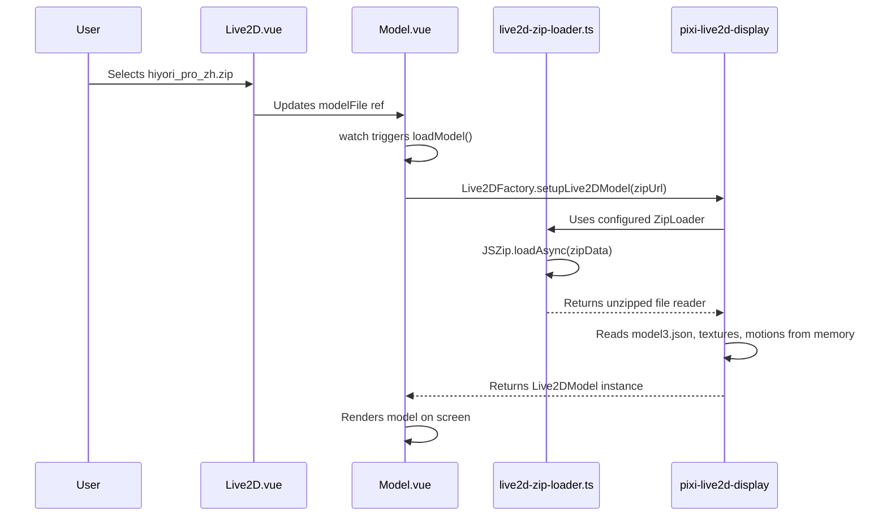

The process of unzipping and loading a Live2D model like `hiyori_pro_zh.zip` is handled entirely on the client-side using `JSZip` and `pixi-live2d-display`. The ZIP file is not extracted to a directory on the file system; instead, it is read and processed in memory.

### Detailed Analysis

#### 1. Dependencies

*   **`jszip`**: A JavaScript library for creating, reading, and editing `.zip` files.
*   **`pixi-live2d-display`**: A library for rendering Live2D models in a PixiJS context. It includes a `ZipLoader` that can be configured to handle zipped models.

#### 2. Implementation

The core logic for handling zipped models is found in three main files:

*   [`packages/stage-ui/src/utils/live2d-zip-loader.ts`](packages/stage-ui/src/utils/live2d-zip-loader.ts)
*   [`packages/stage-ui/src/components/Scenarios/Settings/ModelSettings/Live2D.vue`](packages/stage-ui/src/components/Scenarios/Settings/ModelSettings/Live2D.vue)
*   [`packages/stage-ui/src/components/Scenes/Live2D/Model.vue`](packages/stage-ui/src/components/Scenes/Live2D/Model.vue)

Here is a step-by-step breakdown of the process:

1.  **Configuration of `ZipLoader`**:
    *   In [`live2d-zip-loader.ts`](packages/stage-ui/src/utils/live2d-zip-loader.ts:7), the `ZipLoader.zipReader` from `pixi-live2d-display` is overridden to use `JSZip.loadAsync(data)`. This tells `pixi-live2d-display` to use `JSZip` to read the content of any provided zip file.
    *   The [`ZipLoader.createSettings`](packages/stage-ui/src/utils/live2d-zip-loader.ts:10) function is also customized. If a `model3.json` file is not found within the zip archive, it calls `createFakeSettings` to generate a model settings object by scanning for `.moc3`, `.png`, and motion files.

2.  **File Upload and Model Loading Trigger**:
    *   The user initiates the process by selecting a `.zip` file through a file dialog in the [`Live2D.vue`](packages/stage-ui/src/components/Scenarios/Settings/ModelSettings/Live2D.vue) component.
    *   The [`modelFileDialog.onChange`](packages/stage-ui/src/components/Scenarios/Settings/ModelSettings/Live2D.vue:48) handler captures the selected file and stores it in a reactive `modelFile` variable.
    *   Changing `modelFile` triggers a watcher in [`Model.vue`](packages/stage-ui/src/components/Scenes/Live2D/Model.vue), which in turn calls the `loadModel` function at [`Model.vue:139`](packages/stage-ui/src/components/Scenes/Live2D/Model.vue:139).

3.  **In-Memory Unzipping and Rendering**:
    *   Inside `loadModel`, the [`Live2DFactory.setupLive2DModel`](packages/stage-ui/src/components/Scenes/Live2D/Model.vue:154) function is called.
    *   `pixi-live2d-display` then uses the configured `ZipLoader` to read the zip file's contents in memory. It locates the `model3.json` (or generates settings if it's missing) and then loads all the necessary assets like textures and motion files by reading their paths from the settings file and retrieving them from the in-memory unzipped archive.

4.  **Optional: Motion Map Patching**:
    *   The application also has a feature to modify the motion mappings within the `model3.json` file. The [`patchMotionMap`](packages/stage-ui/src/components/Scenarios/Settings/ModelSettings/Live2D.vue:75) function demonstrates the in-memory manipulation of the zip file. It loads the zip with `JSZip`, modifies the `model3.json` file, and then generates a new zip blob using `zip.generateAsync({ type: 'blob' })` without ever writing to the disk.

### Mermaid Chart

