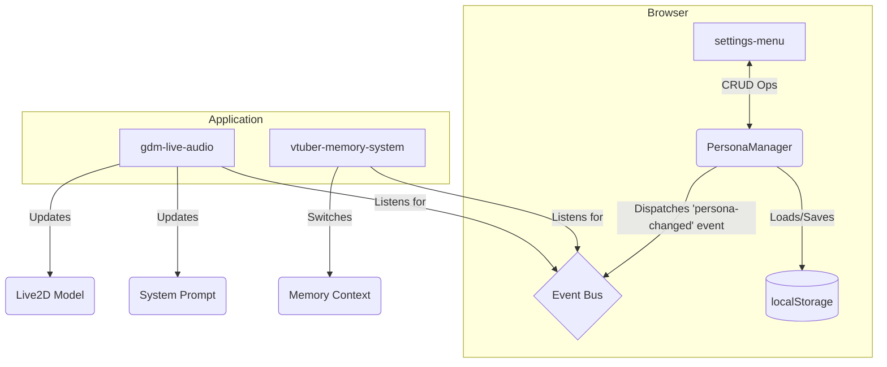

# Technical Design: Persona Management System

## 1. Overview
This document outlines the technical design for the Persona Management System. This system will provide the core functionality for creating, managing, and switching between different AI personas. It will act as a central hub, integrating with the `settings-menu` for the user interface, the `vtuber-memory-system` for persona-specific memories, and the Live2D model loader.

## 2. Architecture
The architecture will be centered around a `PersonaManager` class that handles all persona-related logic. It will be responsible for loading, saving, and managing persona data in `localStorage`. The `settings-menu` component will be updated to interact with this manager, and events will be used to communicate persona changes to the rest of the application.

**Data Flow:**
1.  The `settings-menu` will use the `PersonaManager` to get the list of personas and the current active persona.
2.  When the user creates, updates, or deletes a persona through the UI, the `settings-menu` calls the appropriate method on the `PersonaManager`.
3.  The `PersonaManager` updates the persona data in its internal state and persists the changes to `localStorage`.
4.  If the active persona is changed, the `PersonaManager` dispatches a `persona-changed` event with the new persona object.
5.  The main application component (`gdm-live-audio`) and the `vtuber-memory-system` listen for this event.
6.  Upon receiving the event, the main app updates the system prompt and triggers a reload of the Live2D model.
7.  The `vtuber-memory-system` will switch its context to the memory store associated with the new persona's ID.

## 3. Components and Interfaces

### 3.1. `PersonaManager` (New Class)
- **Responsibility:** Centralizes all logic for persona management.
- **Interface:**
    - `getPersonas(): Persona[]`: Returns a list of all available personas.
    - `getActivePersona(): Persona`: Returns the currently active persona.
    - `setActivePersona(personaId: string): void`: Sets the active persona and dispatches the `persona-changed` event.
    - `createPersona(name: string): Persona`: Creates a new persona with default values and saves it.
    - `updatePersona(persona: Persona): void`: Updates an existing persona.
    - `deletePersona(personaId: string): void`: Deletes a persona.

### 3.2. `settings-menu.ts` (Modification)
- **Responsibility:**
    - Display the list of personas.
    - Allow selection of the active persona.
    - Provide UI for creating and editing personas, including fields for `name`, `systemPrompt`, and `live2dModelUrl`.
    - The `live2dModelUrl` input within the persona form will integrate the validation logic and paste functionality from the previous standalone field.
    - The existing "System Prompt" and "Live2D Model URL" sections will be removed and their functionality consolidated into the new "Persona Management" UI.
    - The "Reset to Default" button will be repurposed or replaced within the context of the default "Gemini-chan" persona. A "+" button will be added to create new personas.

### 3.3. `vtuber-memory-system` (Modification)
- **Responsibility:**
    - Modify the `VectorStore` to handle multiple memory stores, one for each persona. This could be achieved by using the persona's `id` as a prefix or part of the IndexedDB object store name.
    - Listen for the `persona-changed` event to switch to the correct memory store.

## 4. Data Models

### 4.1. `Persona`
This is the core data structure for a persona, which will be stored in an array in `localStorage`.

| Field | Type | Description |
|---|---|---|
| `id` | `string` | A unique identifier (e.g., UUID). |
| `name` | `string` | The user-defined name of the persona. |
| `systemPrompt`| `string` | The system prompt that defines the persona's personality. |
| `live2dModelUrl`| `string` | The URL for the persona's Live2D model. |
| `isDefault` | `boolean` | Flag to indicate if this is a default persona (VTuber or Assistant), which cannot be deleted. |

### 4.2. Default Personas
The system will initialize with two default personas representing different aspects of Gemini-chan:

#### VTuber Persona
- **Name:** "VTuber"
- **Personality:** Friendly, sweet, slightly shy rookie VTuber passionate about coding and learning
- **Model:** Casual appearance suitable for entertainment interactions
- **System Prompt:** Current VTuber personality with occasional slips into formal assistant behavior

#### Assistant Persona  
- **Name:** "Assistant"
- **Personality:** Professional Senior Assistant from corporate background
- **Model:** Business attire reflecting her professional past
- **System Prompt:** Formal, competent assistant suitable for serious tasks

### 4.3. `persona-changed` Event
- **Type:** `CustomEvent`
- **Detail:** `{ persona: Persona }` - The new active persona object.

## 5. Storage
- A single key in `localStorage`, e.g., `geminichan-personas`, will store an array of all `Persona` objects.
- Another key, e.g., `geminichan-active-persona-id`, will store the `id` of the currently active persona.
