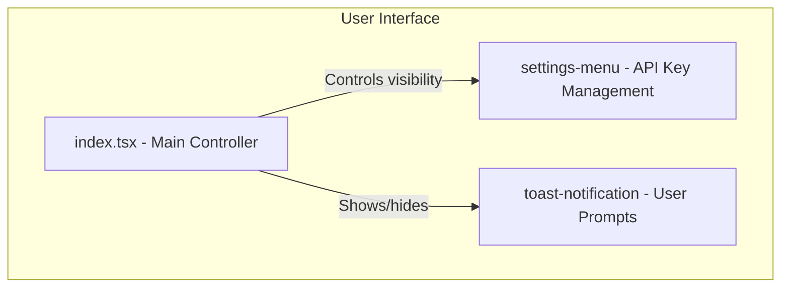
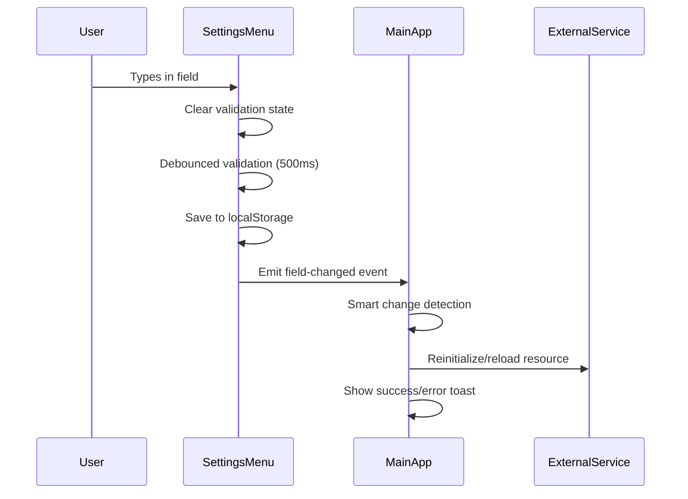

# Technical Design: Settings and API Key Management

## 1. Overview
This document outlines the technical design for the application's settings and API key management. The system ensures that the application is always functional, prompting the user for an API key only when an action requiring it is performed. The key is validated, persisted in local storage, and can be managed through a dedicated settings menu.

## 2. Architecture
The settings management will be handled by a dedicated `settings-menu` component. The main application component (`gdm-live-audio`) will control its visibility and respond to events, such as when a new API key is saved. A `ToastNotification` component will be used to display user prompts.



## 3. Components and Interfaces

### 3.1. `gdm-live-audio` in `index.tsx` (Main Orchestrator)
- **Responsibility:**
    - Control the visibility of the `settings-menu` component.
    - Display toast notifications when an API key is required.
    - Listen for `api-key-saved` events from the settings menu to proceed with pending actions.
    - Listen for `api-key-changed` events to reinitialize the Google GenAI client.
    - Handle client reinitialization and show appropriate toast notifications.

### 3.2. `settings-menu.ts` (Settings Panel)
- **Responsibility:**
    - Provide an input field for the API key.
    - Validate the API key's format in real-time with debounced validation.
    - Save the validated API key to local storage automatically.
    - Provide "Paste" and "Get API Key" buttons.
    - Emit events for API key changes and saves.
- **Properties:**
    - `apiKey: string`
- **Events:**
    - `api-key-saved`: Dispatched when a valid API key is saved (for pending actions).
    - `api-key-changed`: Dispatched when API key changes and is auto-saved (for client reinitialization).
    - `close-settings`: Dispatched when the menu is closed.

### 3.3. `toast-notification.ts` (User Prompts)
- **Responsibility:**
    - Display brief, non-intrusive messages to the user.
    - Can be configured with different message types (e.g., info, error, success).
- **Properties:**
    - `message: string`
    - `type: "info" | "error" | "success" | "warning"`

## 4. Dynamic Field Management Architecture

The settings menu implements a unified pattern for managing both API keys and Live2D model URLs with real-time validation, auto-save, and event-driven updates.

### 4.1. Common Field Management Pattern

Both API key and Live2D model URL fields follow the same architectural pattern:



### 4.2. Real-time Validation and Auto-save

**Common Implementation:**
- Input validation occurs 500ms after user stops typing
- Visual feedback (checkmark/X) appears immediately upon validation
- Auto-save to localStorage occurs on successful validation
- Event emission triggers resource reinitialization

**Field-Specific Behaviors:**
- **API Key**: Required field, preserves existing key when cleared, shows validation error
- **Live2D URL**: Optional field, allows empty values (fallback to sphere), no error on clear

### 4.3. API Key Management

**Validation Rules:**
- Must start with "AIzaSy" and be exactly 39 characters
- Cannot be empty (shows error: "API key cannot be empty")
- Invalid format shows: "Invalid API key format"

**Events:**
- `api-key-changed`: Emitted on successful validation and save
- Triggers Google GenAI client reinitialization

**Smart Change Detection:**
- Compares new API key with `currentApiKey` property
- Skips reinitialization if key hasn't actually changed
- Shows success toast: "API key updated successfully! ✨"

### 4.4. Live2D Model URL Management

**Validation Rules:**
- Supports HTTP, HTTPS, IPFS, and blob protocols
- Accepts .zip and .model3.json file extensions
- Empty values are valid (fallback to 3D sphere)
- IPFS URLs must include valid hash

**Events:**
- `model-url-changed`: Emitted on successful validation and save
- `model-url-error`: Emitted on validation failures
- Triggers Live2D model reload

**Smart Change Detection:**
- Compares new URL with `live2dModelUrl` property
- Skips reload if URL hasn't actually changed
- Shows loading toast: "Loading new Live2D model..."
- Shows success toast: "Live2D model loaded successfully! ✨"

### 4.5. Error Handling Strategy

**Validation Errors:**
- API key errors prevent saving and show validation UI
- Live2D URL errors emit `model-url-error` events with error details
- Both show immediate visual feedback with red X icon

**Runtime Errors:**
- API key reinitialization failures show error toasts
- Live2D loading failures show error toasts with specific error messages
- Graceful degradation (sphere fallback for Live2D failures)

## 5. Data Models

### 5.1. Field Validation Interface
```typescript
interface FieldValidation {
  isValid: boolean;
  errorMessage?: string;
}
```

### 5.2. API Key Validation
```typescript
function validateApiKey(key: string): boolean {
  if (!key.trim()) {
    this._error = "API key cannot be empty";
    return false;
  }
  if (!key.startsWith("AIzaSy") || key.length !== 39) {
    this._error = "Invalid API key format";
    return false;
  }
  return true;
}
```

### 5.3. Live2D URL Validation
```typescript
function validateLive2dUrl(url: string): boolean {
  if (!url) {
    return true; // Empty is OK - will fallback to sphere
  }

  try {
    const urlObj = new URL(url);
    
    // Check protocol - allow HTTP, HTTPS, IPFS, and blob
    const validProtocols = ["http:", "https:", "ipfs:", "blob:"];
    if (!validProtocols.includes(urlObj.protocol)) {
      this._error = "Live2D URL must use HTTP, HTTPS, IPFS, or blob protocol";
      this.dispatchEvent(new CustomEvent("model-url-error", {
        detail: { error: this._error },
        bubbles: true,
        composed: true,
      }));
      return false;
    }

    // For IPFS, basic format check
    if (urlObj.protocol === "ipfs:" && !urlObj.pathname) {
      this._error = "IPFS URL must include a valid hash";
      this.dispatchEvent(new CustomEvent("model-url-error", {
        detail: { error: this._error },
        bubbles: true,
        composed: true,
      }));
      return false;
    }

    // If it has a file extension, validate it's supported
    const pathname = urlObj.pathname.toLowerCase();
    const hasExtension = /\.[a-z0-9]+$/i.test(pathname);
    if (hasExtension && !pathname.endsWith(".zip") && !pathname.endsWith(".model3.json")) {
      this._error = "If specified, file extension must be .zip or .model3.json";
      this.dispatchEvent(new CustomEvent("model-url-error", {
        detail: { error: this._error },
        bubbles: true,
        composed: true,
      }));
      return false;
    }

    return true;
  } catch (err) {
    this._error = "Invalid URL format";
    this.dispatchEvent(new CustomEvent("model-url-error", {
      detail: { error: this._error },
      bubbles: true,
      composed: true,
    }));
    return false;
  }
}
```

### 5.4. Auto-save Configuration
```typescript
interface FieldConfig {
  storageKey: string;
  validator?: (value: string) => boolean;
  eventName?: string;
  required?: boolean;
  preserveOnEmpty?: boolean;
}

// Example configurations:
const API_KEY_CONFIG: FieldConfig = {
  storageKey: "gemini-api-key",
  validator: this._validateApiKey.bind(this),
  eventName: "api-key-changed",
  required: true,
  preserveOnEmpty: true,
};

const LIVE2D_URL_CONFIG: FieldConfig = {
  storageKey: "live2d-model-url",
  validator: this._validateLive2dUrl.bind(this),
  eventName: "model-url-changed",
  required: false,
  preserveOnEmpty: true,
};
```

### 5.5. Event Payloads
```typescript
// Success events (no payload needed)
interface ApiKeyChangedEvent extends CustomEvent<void> {
  type: "api-key-changed";
}

interface ModelUrlChangedEvent extends CustomEvent<void> {
  type: "model-url-changed";
}

// Error events
interface ModelUrlErrorEvent extends CustomEvent<{ error: string }> {
  type: "model-url-error";
  detail: { error: string };
}
```