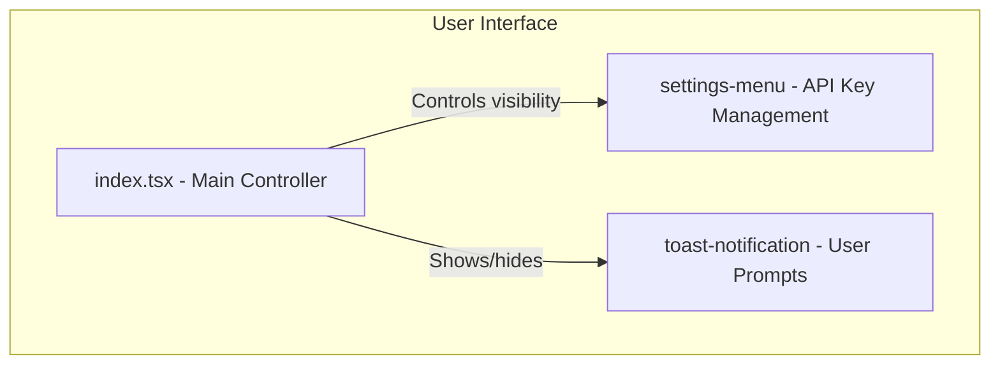

# Technical Design: Settings and API Key Management

## 1. Overview
This document outlines the technical design for the application's settings and API key management. The system ensures that the application is always functional, prompting the user for an API key only when an action requiring it is performed. The key is validated, persisted in local storage, and can be managed through a dedicated settings menu.

## 2. Architecture
The settings management will be handled by a dedicated `settings-menu` component. The main application component (`gdm-live-audio`) will control its visibility and respond to events, such as when a new API key is saved. A `ToastNotification` component will be used to display user prompts.

## 3. Components and Interfaces

### 3.1. `gdm-live-audio` in `index.tsx` (Main Orchestrator)
- **Responsibility:**
    - Control the visibility of the `settings-menu` component.
    - Display toast notifications when an API key is required.
    - Listen for `api-key-saved` events from the settings menu to proceed with pending actions.

### 3.2. `settings-menu.ts` (Settings Panel)
- **Responsibility:**
    - Provide an input field for the API key.
    - Validate the API key's format.
    - Save the validated API key to local storage.
    - Provide "Paste" and "Get API Key" buttons.
    - Emit an `api-key-saved` event upon successful save.
- **Properties:**
    - `apiKey: string`
- **Events:**
    - `api-key-saved`: Dispatched when a valid API key is saved.
    - `close-settings`: Dispatched when the menu is closed.

### 3.3. `toast-notification.ts` (User Prompts)
- **Responsibility:**
    - Display brief, non-intrusive messages to the user.
    - Can be configured with different message types (e.g., info, error).
- **Properties:**
    - `message: string