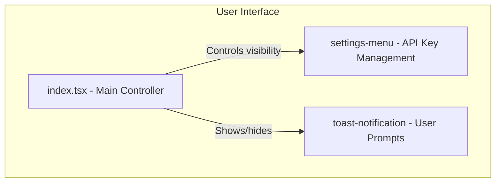
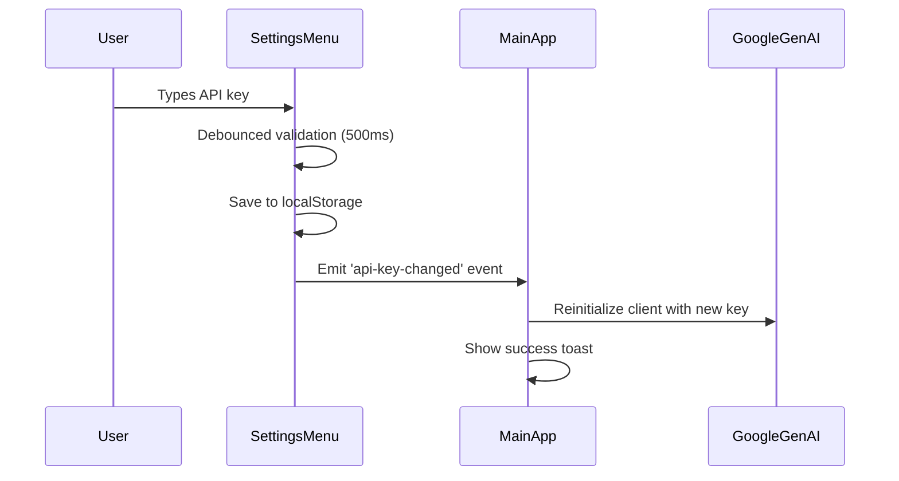

# Technical Design: Settings and API Key Management

## 1. Overview
This document outlines the technical design for the application's settings and API key management. The system ensures that the application is always functional, prompting the user for an API key only when an action requiring it is performed. The key is validated, persisted in local storage, and can be managed through a dedicated settings menu.

## 2. Architecture
The settings management will be handled by a dedicated `settings-menu` component. The main application component (`gdm-live-audio`) will control its visibility and respond to events, such as when a new API key is saved. A `ToastNotification` component will be used to display user prompts.



## 3. Components and Interfaces

### 3.1. `gdm-live-audio` in `index.tsx` (Main Orchestrator)
- **Responsibility:**
    - Control the visibility of the `settings-menu` component.
    - Display toast notifications when an API key is required.
    - Listen for `api-key-saved` events from the settings menu to proceed with pending actions.
    - Listen for `api-key-changed` events to reinitialize the Google GenAI client.
    - Handle client reinitialization and show appropriate toast notifications.

### 3.2. `settings-menu.ts` (Settings Panel)
- **Responsibility:**
    - Provide an input field for the API key.
    - Validate the API key's format in real-time with debounced validation.
    - Save the validated API key to local storage automatically.
    - Provide "Paste" and "Get API Key" buttons.
    - Emit events for API key changes and saves.
- **Properties:**
    - `apiKey: string`
- **Events:**
    - `api-key-saved`: Dispatched when a valid API key is saved (for pending actions).
    - `api-key-changed`: Dispatched when API key changes and is auto-saved (for client reinitialization).
    - `close-settings`: Dispatched when the menu is closed.

### 3.3. `toast-notification.ts` (User Prompts)
- **Responsibility:**
    - Display brief, non-intrusive messages to the user.
    - Can be configured with different message types (e.g., info, error, success).
- **Properties:**
    - `message: string`
    - `type: "info" | "error" | "success" | "warning"`

## 4. Dynamic API Key Management

### 4.1. Real-time Validation and Auto-save
The settings menu will implement debounced validation similar to the Live2D model URL handling:
- Input validation occurs 500ms after user stops typing
- Visual feedback (checkmark/X) appears immediately upon validation
- Auto-save to localStorage occurs on successful validation
- Event emission triggers client reinitialization

### 4.2. Event-driven Architecture


### 4.3. Client Reinitialization Strategy
- Compare new API key with current key to avoid unnecessary reinitialization
- Preserve existing sessions when possible
- Handle reinitialization failures gracefully with error toasts
- Disable AI features when API key is cleared or invalid

## 5. Data Models

### 5.1. API Key Validation
```typescript
interface ApiKeyValidation {
  isValid: boolean;
  errorMessage?: string;
}

function validateApiKey(key: string): ApiKeyValidation {
  if (!key.trim()) {
    return { isValid: false, errorMessage: "API key cannot be empty" };
  }
  if (!key.startsWith("AIzaSy") || key.length !== 39) {
    return { isValid: false, errorMessage: "Invalid API key format" };
  }
  return { isValid: true };
}
```

### 5.2. Auto-save Configuration
```typescript
interface FieldConfig {
  storageKey: string;
  validator: (value: string) => boolean;
  eventName: string;
  required: boolean;
  preserveOnEmpty: boolean;
}
```