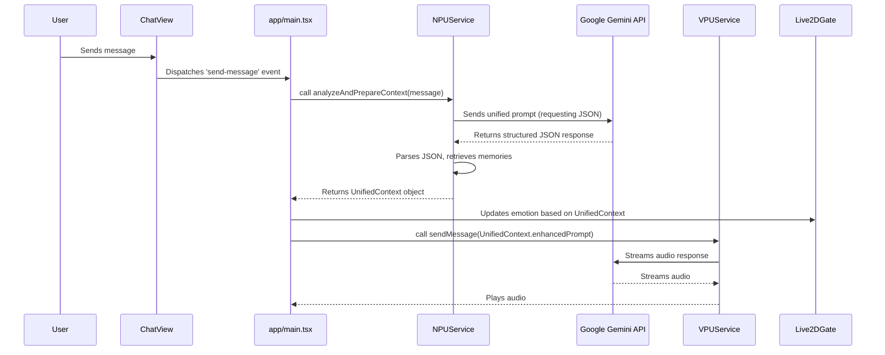

# AEI System v3: Unified NPU-TTS Flow - Design

## 1. Overview

This document outlines the technical design for the AEI System v3, which refactors the TTS flow to unify emotional analysis and memory retrieval into a single NPU operation. The current system makes two distinct API calls: one to `NPUService.analyzeUserInputEmotion` and a second within `TextSessionManager.sendMessageWithMemory` to generate a response.

This redesign introduces a single, powerful NPU method that acts as an intelligent proxy. This method will construct a specialized prompt for the Gemini model, instructing it to perform multiple tasks at once: analyze the user's emotion, assign a confidence score, and integrate retrieved memories. The model's response will be a structured JSON object, which the NPU will parse and format into a `UnifiedContext` object. This object will then be consumed by the `VPUService` for response generation and by the main application for Live2D animation, creating a more efficient and streamlined architecture.

## 2. Architecture

The new architecture consolidates the analytical "thinking" into a single NPU call. The VPU's role is simplified to that of an "actor," delivering the lines prepared by the NPU.

### Flow Diagram



## 3. Components and Interfaces

### 3.1. `NPUService` Refactoring

The `NPUService` will be significantly updated to orchestrate the unified analysis. The existing `analyzeUserInputEmotion` and `createRAGPrompt` will be deprecated in favor of a single, more powerful method.

#### New Data Structures

We will introduce two new interfaces to handle the structured data.

1.  **`UnifiedNpuResponse`**: This interface will model the expected JSON structure from the Gemini API.
    ```typescript
    // In: features/ai/NPUService.ts
    export interface UnifiedNpuResponse {
      emotion: string;
      confidence: number;
    }
    ```

2.  **`UnifiedContext`**: This interface will be the return type of the new primary NPU method, packaging all necessary information for the VPU and UI.
    ```typescript
    // In: features/ai/NPUService.ts
    export interface UnifiedContext {
      emotion: string;
      confidence: number;
      retrievedMemories: Memory[];
      enhancedPrompt: string;
    }
    ```

#### New Method

A new primary method will be added to `NPUService`.

*   **`analyzeAndPrepareContext(userMessage: string, personaId: string): Promise<UnifiedContext>`**
    *   **Responsibility:**
        1.  Retrieve relevant memories using the existing `memoryService`.
        2.  Construct a new, complex prompt for the Gemini API. This prompt will include the user's message, the memory context, and explicit instructions to return a JSON object with `emotion` and `confidence` fields.
        3.  Call the `aiClient.models.generateContent` method.
        4.  Parse the returned text to extract and validate the JSON content.
        5.  Populate and return the `UnifiedContext` object.
    *   **Dependencies:** `MemoryService`, `AIClient`.

### 3.2. Unified Prompt Design

A new prompt will be engineered to instruct the `gemini-2.5-flash` model to act as the NPU.

**Example Prompt Structure:**

```
SYSTEM: You are an intelligent Neural Processing Unit (NPU). Your task is to analyze the user's message, assess their emotional state, and prepare a final prompt for a separate AI to respond to.

You MUST reply with a single, valid JSON object containing two keys: "analysis" and "prompt_for_vpu".

1.  The "analysis" key must contain an object with two keys:
    - "emotion": A single lowercase word describing the user's primary emotion from this list: [joy, sadness, anger, fear, surprise, neutral].
    - "confidence": A float between 0.0 and 1.0 representing your confidence in the emotion detection.

2.  The "prompt_for_vpu" key must contain the final, enhanced prompt string for the VPU (Vocal Processing Unit). This prompt should incorporate the provided context to help the VPU respond naturally. Do not mention the memories or context explicitly in this prompt.

CONTEXT FROM PREVIOUS CONVERSATIONS:
[1] The user's favorite color is blue.
[2] The user recently finished a project and is feeling accomplished.

USER'S MESSAGE:
I finally finished my big project and I'm so happy I can relax now!

YOUR JSON RESPONSE:
```

### 3.3. `VPUService` Simplification

The `TextSessionManager` within the `VPUService` will be simplified. Its responsibility to construct a RAG prompt will be removed, as this is now handled entirely by the NPU.

*   **`sendMessageWithMemory(message: string, emotion: string)`**: This method will be deprecated or removed.
*   **A new, simpler method will be used, likely `sendMessage(prompt: string)`**: This method will simply take the `enhancedPrompt` from the NPU's `UnifiedContext` and send it to the Gemini Live API for speech generation. The logic for injecting emotion as a system note will be handled by the NPU's prompt generation.

### 3.4. `app/main.tsx` Integration

The main application component will be updated to use the new NPU flow.

*   **`_handleSendMessage(e: CustomEvent)`**:
    1.  This method will no longer call `npuService.analyzeUserInputEmotion`.
    2.  It will now call the new `npuService.analyzeAndPrepareContext(message, personaId)`.
    3.  Upon receiving the `UnifiedContext` object, it will:
        *   Update `this.currentEmotion` with `UnifiedContext.emotion`.
        *   (Future) Use `UnifiedContext.confidence` for more nuanced animation.
        *   Call the simplified `textSessionManager.sendMessage(UnifiedContext.enhancedPrompt)`.

## 4. Error Handling

*   **JSON Parsing Failure:** If the Gemini API response is not valid JSON or is missing required fields, the `NPUService` will gracefully degrade. It will log the error and return a default `UnifiedContext` object where:
    *   `emotion` is "neutral".
    *   `confidence` is 0.5.
    *   `enhancedPrompt` is the original, unmodified user message.
*   **API Errors:** Standard error handling for API calls (e.g., rate limiting) will remain in place.

## 5. Testing Strategy

*   **`NPUService` Unit Tests:**
    *   Test the `analyzeAndPrepareContext` method.
    *   Mock the Gemini API response with valid JSON and assert that the `UnifiedContext` object is correctly formed.
    *   Mock the Gemini API response with invalid/malformed JSON and assert that the system gracefully falls back to the default neutral state.
    *   Verify that retrieved memories are correctly incorporated into the prompt sent to the API.
*   **Integration Tests:**
    *   Test the full flow from `app/main.tsx` through `NPUService` to `VPUService` to ensure the components interact correctly with the new data structures.