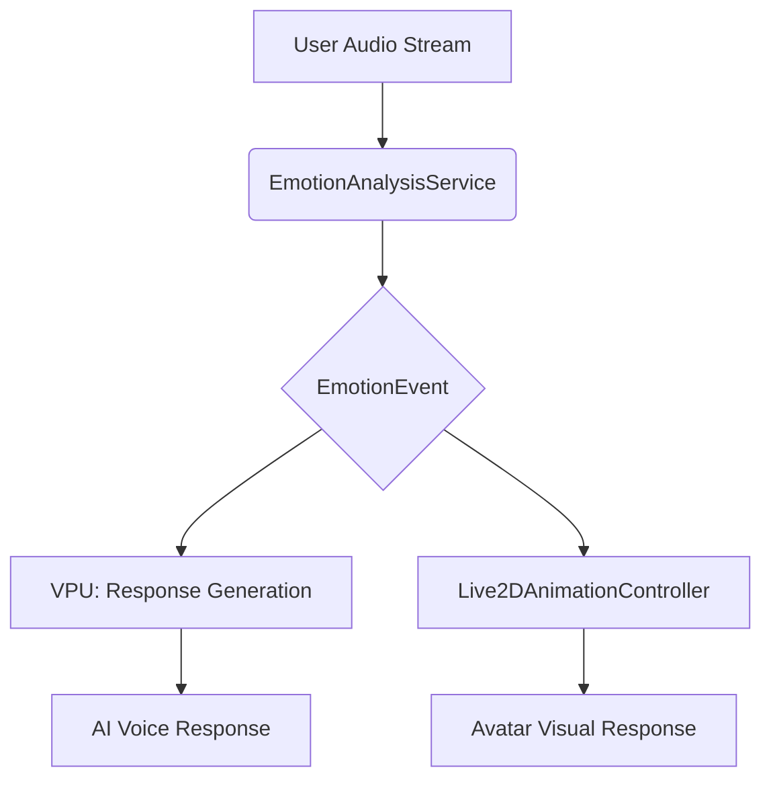

# Technical Blueprint: Emotional Intelligence System v1

**Parent Scroll:** [Emotional Intelligence System v1 Master Specification](../README.md)

This document charts the technical constellation for the Artificial Emotional Intelligence (AEI) system. It defines the new components (stars), their relationships (orbits), and the flow of data (stardust) required to forge the empathetic soul described in the foundational lore.

## 1. Architectural Overview: The Flow of Stardust

The AEI system will be woven directly into the existing real-time voice call infrastructure. It is designed as a parallel, non-blocking stream of analysis that enriches the primary conversation loop without introducing latency.

The flow is as follows:

1.  **User's Voice (Audio Stream):** The raw audio data from the user during a call is the origin point of all emotional stardust.
2.  **`EmotionAnalysisService` (The Seeing Eye):** This new service continuously processes the audio stream in real-time. It uses a specialized model to detect emotional cues (tone, pitch, cadence) and emits structured `EmotionEvent` data.
3.  **Dual Stardust Streams:** The `EmotionEvent` data flows to two destinations simultaneously:
    *   **To the `VPU` (The Resonant Voice):** The event is used to modulate the VPU's response. This includes informing the core LLM to tailor the *content* of its reply and instructing the TTS engine to adjust the *vocal tone* (e.g., brighter for joy, softer for sadness).
    *   **To the `Live2DAnimationController` (The Living Body):** The event triggers a corresponding facial expression or subtle animation on the Live2D avatar, providing immediate, non-verbal feedback.

This parallel design ensures that the AI's verbal, vocal, and visual responses are all in perfect, synchronized harmony with the user's detected emotion.



## 2. New Celestial Bodies (Components)

### a. `EmotionAnalysisService`

*   **Purpose:** To encapsulate the logic for real-time speech emotion recognition (SER).
*   **Location:** `features/emotion/EmotionAnalysisService.ts`
*   **Core Method:** `analyzeStream(audioChunk: ArrayBuffer): Promise<EmotionEvent | null>`
*   **Dependencies:**
    *   A pre-trained, client-side SER model (e.g., from TensorFlow.js Hub, ONNX Runtime Web). The selection of this model is a critical task for the Fate Weaver.
*   **Output:** A structured `EmotionEvent` object.
    ```typescript
    interface EmotionEvent {
      emotion: 'Joy' | 'Sadness' | 'Anger' | 'Excitement' | 'Neutral';
      intensity: number; // A score from 0.0 to 1.0
      timestamp: number;
    }
    ```

### b. `VPU` (Enhancements)

*   **Purpose:** The existing Vocal Processing Unit will be enhanced to become context-aware.
*   **Location:** `features/vpu/VPUService.ts` (and related components)
*   **Enhancements:**
    1.  **Prompt Enrichment:** The logic that constructs the prompt for the core LLM will be modified to accept an optional `EmotionEvent`. The system prompt will be updated to instruct the model to consider this emotional context when formulating its reply.
    2.  **TTS Modulation:** The TTS generation logic will be updated to accept parameters that control prosody (pitch, rate, volume). The `VPUService` will translate an incoming `EmotionEvent` into the appropriate TTS settings.

### c. `Live2DAnimationController` (Enhancements)

*   **Purpose:** The existing controller for the Live2D avatar will be enhanced to manage emotional expressions.
*   **Location:** `features/live2d/Live2DAnimationController.ts`
*   **Enhancements:**
    1.  **New Public Method:** `expressEmotion(emotion: EmotionEvent): void`.
    2.  **State Management:** This method will map an `EmotionEvent` to a specific animation trigger (e.g., `startSmile`, `showConcern`). It will manage the transition between emotional states and ensure a graceful return to a neutral idle state.

## 3. Unbreakable Laws (Architectural Constraints)

*   **Client-Side First:** All emotion analysis must be performed on the client-side to ensure user privacy and minimize latency. No raw user audio shall be sent to a server for the purpose of emotion analysis.
*   **Low Latency is Sacred:** The AEI pipeline must not add more than 100ms of latency to the VPU's response time. Asynchronous, non-blocking operations are mandatory.
*   **Graceful Degradation:** If the `EmotionAnalysisService` fails or cannot confidently classify an emotion, the system must seamlessly default to a `Neutral` state. The user experience should be unaffected by a failure in the AEI subsystem.