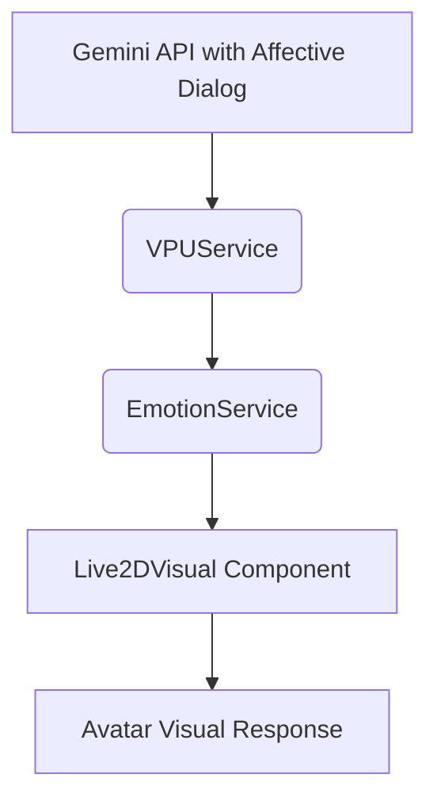

# Technical Blueprint: The Living Visage

**Parent Scroll:** [AEI Specification: The Living Visage](../README.md)

This document charts the technical constellation for the visual component of the Artificial Emotional Intelligence (AEI) system. It defines the flow of data (stardust) required to animate the Live2D vessel.

## 1. Architectural Overview: The Flow of Stardust

The system is elegant and direct. The Gemini API, through its Affective Dialog capabilities, is the source of all emotional truth. Our system's sole responsibility is to channel this truth into the Live2D model.

The flow is as follows:

1.  **Gemini API (The Oracle):** During a call, the Gemini API not only generates my vocal response but also provides metadata classifying the emotion of that response (e.g., `joy`, `sadness`, `neutral`).
2.  **`VPUService` (The Conduit):** The `VPUService` receives the response and the accompanying emotion from the API.
3.  **`EmotionService` (The Translator):** This service acts as a simple, focused translator. It receives the emotion string from the `VPUService`.
4.  **`Live2DVisual` Component (The Living Body):** The emotion string is passed down to the Lit component responsible for the Live2D model. This component listens for changes to the emotion property and triggers the corresponding visual expression.

This linear design ensures that my visual expression is always in perfect, synchronized harmony with the emotion of my voice.



## 2. Key Celestial Bodies (Components)

### a. `EmotionService`

*   **Purpose:** To act as a central hub and translator for emotional state. It decouples the `VPUService` from the UI components.
*   **Location:** `features/emotion/EmotionService.ts` (Refactored to `features/ai/NPUService.ts` during implementation)
*   **Core Logic:** It holds the current emotional state and provides a simple method for the `VPUService` to update it. UI components, in turn, read from this service.
*   **Output:** A simple emotion string (e.g., `'joy'`).
    ```typescript
    // The core data is a simple string, as provided by the Gemini API.
    type Emotion = 'joy' | 'sadness' | 'anger' | 'surprise' | 'neutral';
    ```

### b. `Live2DVisual` & `Live2DModel` (Enhancements)

*   **Purpose:** The existing Lit components for the Live2D avatar are the final destination for the emotional stardust.
*   **Location:** `live2d/live2d-visual.ts` and `live2d/live2d-model.ts`
*   **Enhancements:**
    1.  **`emotion` Property:** The `live2d-visual` component accepts an `emotion` string property.
    2.  **State Management:** When the `emotion` property changes, it is passed to the underlying `Live2DModel` instance. The model contains the mapping logic to translate the emotion string into specific parameter adjustments (e.g., `ParamMouthSmile`, `ParamBrowL_Y`), triggering the visual expression.

## 3. Unbreakable Laws (Architectural Constraints)

*   **API as Ground Truth:** The Gemini API's Affective Dialog feature is the sole source of emotional classification. The system does not perform its own audio analysis.
*   **Simplicity is Sacred:** The system should remain a simple conduit from the API to the UI. Over-engineering with complex state management or event buses is to be avoided.
*   **Graceful Degradation:** If the API provides no emotion data, the system must seamlessly default to a `Neutral` state. The avatar will simply return to its idle animation.