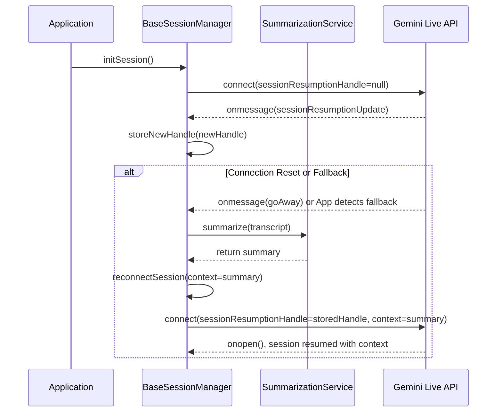

# Technical Design: Gemini Live API Session Management

### Overview

This document outlines the technical design for the **Gemini Live API Session Management** feature. The goal is to create a robust, resilient connection manager that can handle the Gemini Live API's specific session and connection lifecycle. The proposed solution involves a client-side `SessionManager` that will handle session resumption and graceful connection termination, ensuring a seamless experience even with periodic network resets.

### Architecture

Key decisions:
- Do not resume across page reloads. The resumption handle is only used within the current page lifecycle to simplify UX. The handle may be temporarily persisted per mode to facilitate resume within the same tab/session, but on explicit reset or reload it is not honored for resume.
- Call-first resume flow: The UI attempts to resume call sessions first; on failure a new session is started with a clear toast. Text parity can be introduced later.
- Transcript display is coupled to session action: fresh call clears the transcript, resumed call pre-populates with last summarized transcript.

The proposed architecture extends the existing `BaseSessionManager` to handle session resumption and graceful connection termination. This approach reuses the existing session management infrastructure while adding the necessary resilience.

**Data Flow:**
1.  The Application calls `initSession()` on a `BaseSessionManager` subclass.
2.  The manager connects to the Gemini Live API.
3.  The API provides a `sessionResumptionUpdate` handle, which is stored.
4.  On connection reset or model fallback, the `BaseSessionManager` calls the `SummarizationService`.
5.  The summarization service returns a shortened context string.
6.  The `BaseSessionManager` reconnects, providing the resumption handle and the summarized context.

### Components and Interfaces

#### 1. BaseSessionManager (Modified)
*   **Responsibility:** Manages the session lifecycle, including session resumption, graceful disconnection, and context injection on fallback.
*   **Interface (New and Modified Methods):**
    *   `initSession(resumptionHandle?: string): Promise<boolean>`: Modified to accept an optional resumption handle.
    *   `reconnectSession(): Promise<void>`: A new method to handle reconnection logic.
    *   `handleFallback(transcript: Turn[]): Promise<string>`: A new method to summarize the transcript and return the context to be injected.
    *   The `onmessage` callback within `getCallbacks()` will be updated to parse `sessionResumptionUpdate` and `goAway` messages.

#### 2. TextSessionManager & CallSessionManager (Subclasses)
*   **Responsibility:** These classes will inherit the new session management capabilities from `BaseSessionManager` with minimal changes.

#### 3. SummarizationService (Existing)
*   **Responsibility:** Summarizes a conversation transcript to reduce its length while preserving the context. This service is located at `features/summarization/SummarizationService.ts`.
*   **Interface:**
    *   `summarize(transcript: Turn[]): Promise<string>`: Takes a transcript and returns a summarized string. This service will eventually be updated to only summarize long transcripts once a tokenizer is available.

### Data Models

#### Session State
The `SessionManager` will maintain an internal state object:

| Property                | Type          | Description                                         |
|-------------------------|---------------|-----------------------------------------------------|
| `currentHandle`         | `string` \| `null` | The session resumption handle from the API.         |
| `isConnected`           | `boolean`     | The current connection status.                      |
| `lastMessageTimestamp`  | `number`      | Timestamp of the last received message for timeouts. |

### Error Handling

| Error Condition              | Handling Strategy                                                                                             |
|------------------------------|---------------------------------------------------------------------------------------------------------------|
| Invalid/Expired Token        | The `SessionManager` will catch the error on connection, clear the expired handle, and start a new session.   |
| Network Failure on Reconnect | The `SessionManager` will implement an exponential backoff strategy for reconnection attempts.                |
| Unexpected Disconnection     | If the connection is lost without a `GoAway` message, the `SessionManager` will immediately attempt to reconnect. |

### Testing Strategy

*   **Unit Tests:** Each method in the `SessionManager` will be tested in isolation. Mocks will be used for the Gemini Live API to simulate different scenarios (e.g., receiving a `GoAway` message, an invalid token error).
*   **Integration Tests:** The `SessionManager` will be tested against a live or sandboxed Gemini Live API to ensure it correctly handles the connection lifecycle.
*   **End-to-End (E2E) Tests:** An automated test will simulate a full conversation, including a connection reset, to verify that the session is seamlessly resumed.