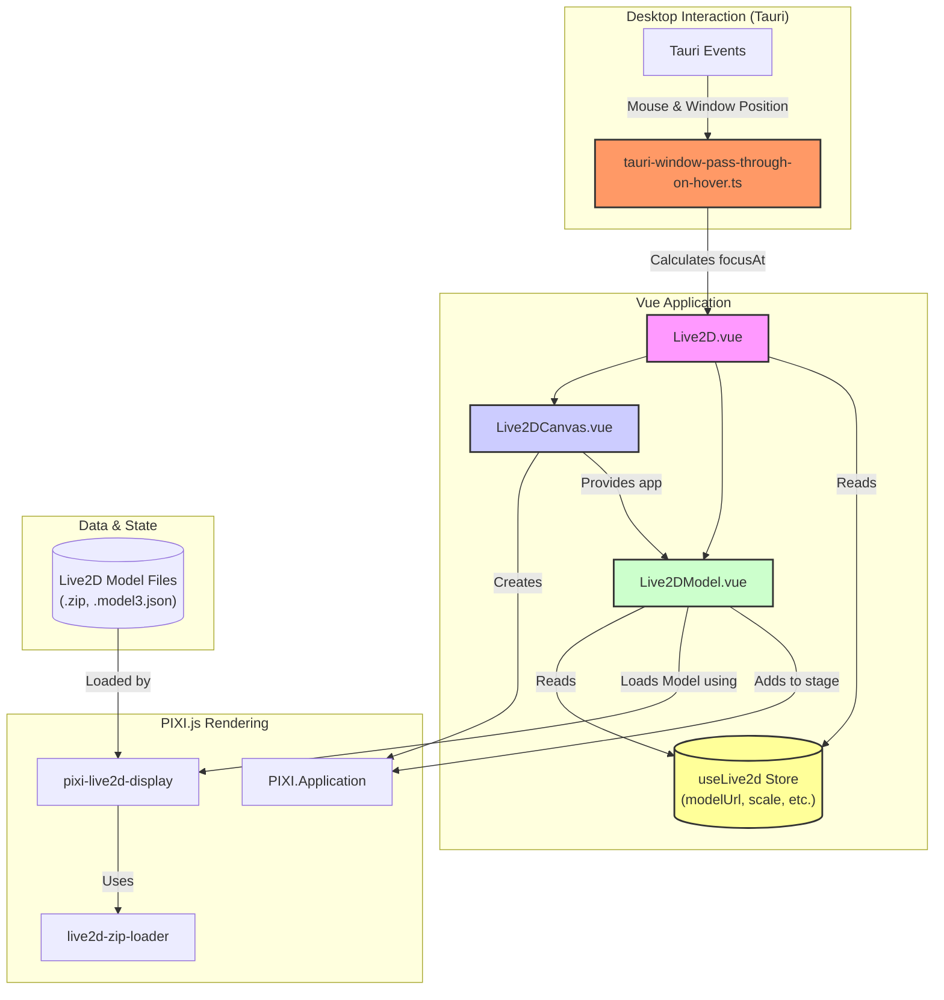

This research report provides a detailed analysis of how Live2D models are rendered within this project, outlining the key components, their interactions, and the underlying technologies.

### Documentation Insights

The primary documentation found is a developer log entry in [`docs/content/en/blog/DevLog-2025.06.08/index.md`](docs/content/en/blog/DevLog-2025.06.08/index.md). It details the implementation of the model's ability to focus on the cursor, a key interactive feature.

Key takeaways from the documentation:
- The application uses the `focus` method from the `pixi-live2d-display` library to make the model look at a specific point.
- For the desktop application (`stage-tamagotchi`), Tauri is used to get the global cursor position and the window's position on the screen.
- A calculation is performed to determine the cursor's position relative to the application window.
- The document highlights the need to handle coordinate system differences between Windows and macOS. On macOS, the Y-axis origin is at the bottom-left, whereas for the web and Windows, it's at the top-left.

### Core Dependencies

The Live2D rendering is built upon a foundation of several key libraries:

- **Vue.js**: The core frontend framework used for building the user interface components.
- **PIXI.js**: A fast, lightweight 2D rendering library. It provides the canvas and rendering context.
  - [`@pixi/app`](https://www.npmjs.com/package/@pixi/app): Core PIXI Application.
  - [`@pixi/ticker`](https://www.npmjs.com/package/@pixi/ticker): Handles the render loop.
  - [`@pixi/interaction`](https://www.npmjs.com/package/@pixi/interaction): Manages user interaction events.
- **pixi-live2d-display**: A PIXI.js plugin specifically for rendering Live2D models. It handles loading model assets, managing animations (motions), and controlling model parameters.
- **JSZip**: Used for loading Live2D models that are packaged as `.zip` archives. The project includes a custom loader to handle zip files that may not have a standard `model3.json` file.
- **Pinia**: For state management, holding reactive data about the Live2D model's source, position, and scale.

### Type Definitions and Interfaces

The main props and types are defined within the Vue components themselves.

- **[`Live2D.vue`](packages/stage-ui/src/components/Scenes/Live2D.vue:8-19)** defines the high-level properties for the scene:
  - `modelSrc?: string`: URL to the Live2D model file (`.model3.json` or `.zip`).
  - `modelFile?: File | null`: A local `File` object for the model.
  - `paused?: boolean`: Pauses the model's animation.
  - `mouthOpenSize?: number`: Controls the mouth opening.
  - `focusAt?: { x: number, y: number }`: The coordinates for the model to look at.
  - `xOffset`, `yOffset`, `scale`: For positioning and scaling the model.

- **[`Live2DModel.vue`](packages/stage-ui/src/components/Scenes/Live2D/Model.vue:17-22)** defines internal types for interacting with the `pixi-live2d-display` models:
  - `CubismModel`: The core model from the Live2D Cubism SDK.
  - `PixiLive2DInternalModel`: The internal model object from `pixi-live2d-display`.

### Implementation Details

The rendering process is modular, broken down into several Vue components and composables.

#### 1. Scene and Canvas Setup

- **[`Live2D.vue`](packages/stage-ui/src/components/Scenes/Live2D.vue)**: This is the main entry component. It orchestrates the rendering by composing the `Live2DCanvas` and `Live2DModel` components. It passes down props that control the model's appearance and behavior.
- **[`Live2DCanvas.vue`](packages/stage-ui/src/components/Scenes/Live2D/Canvas.vue)**:
  - Its primary role is to initialize the `PIXI.Application` instance.
  - In the [`initLive2DPixiStage` function](packages/stage-ui/src/components/Scenes/Live2D/Canvas.vue:22), it sets up the PIXI application with a transparent background and appends the canvas element to the DOM.
  - It registers necessary PIXI plugins for Ticker (game loop) and Interaction.
  - It passes the created `PIXI.Application` instance (`app`) to its child components via a scoped slot.

#### 2. Model Loading and Rendering

- **[`Live2DModel.vue`](packages/stage-ui/src/components/Scenes/Live2D/Model.vue)**: This component is the heart of the Live2D rendering.
  - It receives the `app` instance from `Live2DCanvas.vue`.
  - The [`loadModel` function](packages/stage-ui/src/components/Scenes/Live2D/Model.vue:139) is responsible for loading the model. It uses [`Live2DFactory.setupLive2DModel`](packages/stage-ui/src/components/Scenes/Live2D/Model.vue:154) from `pixi-live2d-display` to load the model assets from a given source (`modelSrc` or `modelFile`).
  - Once the model is loaded, it's added to the PIXI stage for rendering: [`pixiApp.value.stage.addChild(model.value)`](packages/stage-ui/src/components/Scenes/Live2D/Model.vue:157).
  - The [`setScaleAndPosition` function](packages/stage-ui/src/components/Scenes/Live2D/Model.vue:106) calculates the appropriate scale and position to fit the model within the canvas dimensions.
  - It uses a `watch`er on the [`focusAt` prop](packages/stage-ui/src/components/Scenes/Live2D/Model.vue:299) to call `model.value.focus(value.x, value.y)`, making the model look at the specified coordinates.
  - It also handles motions, lip-sync (`ParamMouthOpenY`), and other interactions.

#### 3. State Management

- **[`packages/stage-ui/src/stores/live2d.ts`](packages/stage-ui/src/stores/live2d.ts)**: A Pinia store is used to manage the global state for the Live2D model.
  - `modelUrl`: The URL of the current model.
  - `modelFile`: A local file object for the model.
  - `position`, `scale`: The position and scale of the model on the stage.
  - This allows other components, like settings panels, to easily modify the Live2D scene.

#### 4. Custom Zip Loader

- **[`packages/stage-ui/src/utils/live2d-zip-loader.ts`](packages/stage-ui/src/utils/live2d-zip-loader.ts)**: This utility patches the `ZipLoader` from `pixi-live2d-display`.
  - The purpose is to support `.zip` files that don't contain a `.model3.json` settings file.
  - The [`createFakeSettings` function](packages/stage-ui/src/utils/live2d-zip-loader.ts:34) programmatically constructs a valid model settings object by identifying the `.moc3` file, textures (`.png`), and motion files within the archive. This makes the model loading process more flexible and user-friendly.

#### 5. Desktop Integration (Tauri)

- **[`apps/stage-tamagotchi/src/composables/tauri-window-pass-through-on-hover.ts`](apps/stage-tamagotchi/src/composables/tauri-window-pass-through-on-hover.ts)**: This composable is specific to the `stage-tamagotchi` desktop app.
  - It uses Tauri's event system to listen for the global mouse position and the application's window frame.
  - The [`updateLive2DLookAt` function](apps/stage-tamagotchi/src/composables/tauri-window-pass-through-on-hover.ts:86) calculates the relative coordinates of the cursor within the window, accounting for platform-specific differences (macOS vs. Windows), as described in the dev log.
  - These calculated coordinates are then fed into the `focusAt` prop of the `Live2D.vue` component.

### Mermaid Chart: Rendering Flow

