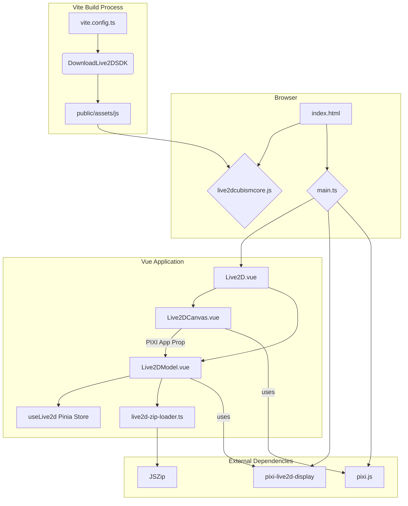

I've completed the research and analysis of your project's Live2D integration. Here is a comprehensive report detailing the findings.

### **Live2D Integration Report**

This report outlines the key architectural patterns, configurations, and implementation details for integrating Live2D Cubism 4 with `pixi-live2d-display` in your Vite-based Lit/PIXI application.

---

#### **1. Cubism 4 Runtime Loading**

The project employs a traditional and effective method for loading the Cubism Core SDK.

*   **Provisioning Method**: The `live2dcubismcore.js` script is loaded via a direct `<script>` tag in the `<head>` of [`apps/stage-web/index.html:34`](apps/stage-web/index.html:34). This is not an NPM package but a local file managed by a custom build process.
*   **Loading Mechanism**: The script is loaded as a global, attaching `Live2DCubismCore` to the `window` object. It is loaded synchronously before the main application bundle, ensuring it is available when `pixi-live2d-display` is initialized.
*   **Runtime Availability**: The script's presence is guaranteed at runtime due to the blocking nature of the `<script>` tag in `index.html`. A custom Vite plugin, `@proj-airi/unplugin-live2d-sdk`, handles downloading and placing the SDK in the correct directory during the build.

#### **2. Bundling & Build Configuration**

The project uses Vite with a hybrid ESM and UMD approach to handle the Cubism SDK.

*   **Bundler**: The project is built with Vite, as confirmed by the [`apps/stage-web/vite.config.ts`](apps/stage-web/vite.config.ts) file.
*   **Vite Configuration**:
    *   The `DownloadLive2DSDK` Vite plugin is used to manage the Cubism SDK dependency.
    *   The `optimizeDeps.exclude` array in [`apps/stage-web/vite.config.ts:32-47`](apps/stage-web/vite.config.ts:32-47) is correctly configured to prevent Vite from processing the `@framework/*` modules, which are provided by the global `live2dcubismcore.js` script.
*   **TypeScript Shims**: No explicit TypeScript declaration shims for `pixi-live2d-display/cubism4` or the Cubism core were found. The necessary types are likely included within the `pixi-live2d-display` package itself.

#### **3. Live2D Model Loading Flow**

The application is designed to load models from `.zip` archives, providing a streamlined experience.

*   **Zip vs. `model3.json`**: The project uses a custom `live2d-zip-loader` ([`packages/stage-ui/src/utils/live2d-zip-loader.ts`](packages/stage-ui/src/utils/live2d-zip-loader.ts)) that patches `pixi-live2d-display`'s `ZipLoader`. This loader can dynamically generate a `model3.json` file if one is not present in the zip archive, making the loading process more robust.
*   **CORS**: For models loaded from a URL, the remote server must have the appropriate CORS headers. For local and user-uploaded models, CORS is not an issue.
*   **Error Handling**: Basic error handling is in place. The `loadModel` function in [`packages/stage-ui/src/components/Scenes/Live2D/Model.vue`](packages/stage-ui/src/components/Scenes/Live2D/Model.vue) logs a warning if no model source is provided. There is no explicit retry logic or user-facing error overlay.

#### **4. Application Architecture**

The application follows a modern, component-based architecture.

*   **PIXI App Management**: The PIXI `Application` instance is created in [`Live2DCanvas.vue`](packages/stage-ui/src/components/Scenes/Live2D/Canvas.vue) and passed down to child components as a prop via a scoped slot.
*   **State Management**: Pinia is used for state management. The `useLive2d` store ([`packages/stage-ui/src/stores/live2d.ts`](packages/stage-ui/src/stores/live2d.ts)) manages the model's state, including its source, loading status, and motions.
*   **Component Structure**: The Live2D functionality is encapsulated within the `Live2DCanvas` and `Live2DModel` Vue components, promoting separation of concerns.

---

### **Compatibility Matrix**

| Library                 | Version         | Notes                                                               |
| ----------------------- | --------------- | ------------------------------------------------------------------- |
| `live2dcubismcore.js`   | `5-r.3`         | Loaded as a global script.                                          |
| `pixi-live2d-display`   | `^0.4.0`        | Used for rendering and managing Live2D models.                      |
| `pixi.js`               | `^6.5.10`       | The core rendering library.                                         |
| `typescript`            | `~5.9.2`        | The version of TypeScript used in the project.                      |
| `vite`                  | `^7.0.6`        | The build tool and development server.                              |

---

### **Code Snippets & Best Practices**

#### **Minimal Working Sequence (Vite)**

1.  **Install Dependencies**:
    ```bash
    pnpm add pixi.js pixi-live2d-display jszip
    ```
2.  **Load Cubism Core SDK**: Include the `live2dcubismcore.js` script in your `index.html`.

    ```html
    <script src="/path/to/live2dcubismcore.min.js"></script>
    ```
3.  **Initialize PIXI and Live2D**: In your main application file:

    ```typescript
    import { Application } from 'pixi.js';
    import { Live2DModel } from 'pixi-live2d-display/cubism4';
    import JSZip from 'jszip';

    // Make JSZip available to pixi-live2d-display
    (window as any).JSZip = JSZip;

    // The rest of your application logic...
    ```

#### **Runtime Load Order**

The current implementation relies on a specific load order:

1.  `live2dcubismcore.min.js` is loaded via a `<script>` tag.
2.  The main application bundle is loaded, which imports `pixi.js` and `pixi-live2d-display`.
3.  `pixi-live2d-display` detects the global `Live2DCubismCore` and uses it.

---

### **Architectural Diagram**

