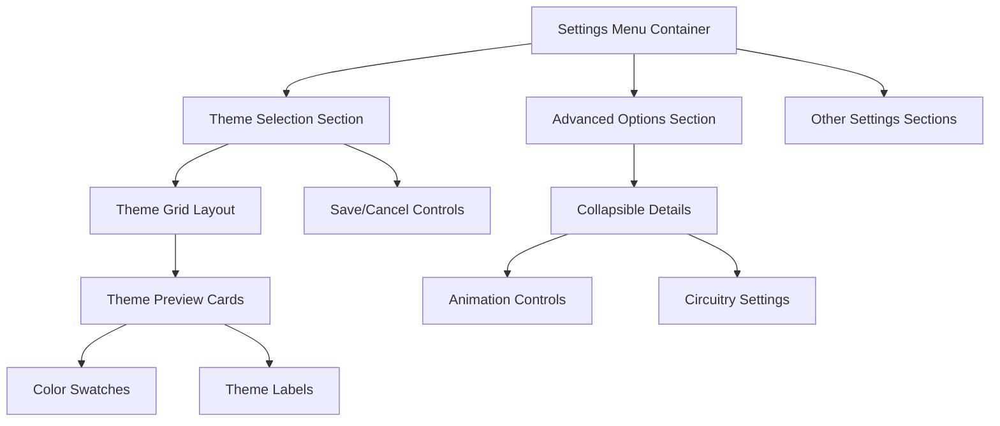

# Technical Design: Advanced Theme Settings Interface

## 1. Overview

This design document outlines the technical approach for redesigning the theme settings interface to provide a modern, intuitive, and visually appealing user experience. The redesign focuses on improving visual hierarchy, adding theme previews, enhancing interactions, and creating a more professional overall appearance.

## 2. Architecture

The redesign will enhance the existing `settings-menu.ts` component without breaking existing functionality. The approach uses CSS-in-JS with Lit's styling system to create a cohesive design that integrates seamlessly with the current theme engine.

### 2.1. Component Structure



## 3. Visual Design System

### 3.1. Theme Preview Cards

Each theme will be represented by a card that includes:
- **Color Gradient Preview**: A visual representation of the theme's primary colors
- **Theme Name**: Clear, readable typography
- **Active State Indicator**: Distinctive styling for the currently selected theme
- **Hover Effects**: Smooth transitions and enhanced visual feedback

### 3.2. Design Tokens

```css
/* Enhanced Design Tokens */
--theme-card-width: 120px;
--theme-card-height: 80px;
--theme-card-radius: 12px;
--theme-card-border: 2px;
--theme-card-spacing: 12px;

--animation-duration-fast: 0.15s;
--animation-duration-medium: 0.25s;
--animation-easing: cubic-bezier(0.4, 0, 0.2, 1);

--shadow-subtle: 0 2px 8px rgba(0, 0, 0, 0.1);
--shadow-elevated: 0 4px 16px rgba(0, 0, 0, 0.15);
--shadow-theme-glow: 0 0 0 2px var(--theme-accent), 0 4px 16px var(--theme-accent-alpha);
```

### 3.3. Theme Color Mappings

Each theme will have associated preview colors:

```typescript
const THEME_PREVIEWS = {
  cyberpunk: {
    primary: '#00e5ff',
    secondary: '#ff00e5',
    gradient: 'linear-gradient(135deg, #00e5ff, #7c4dff, #ff00e5)'
  },
  dystopia: {
    primary: '#23d5ff',
    secondary: '#6a4cff',
    gradient: 'linear-gradient(135deg, #23d5ff, #6a4cff, #b400ff)'
  },
  tron: {
    primary: '#00f0ff',
    secondary: '#00bfff',
    gradient: 'linear-gradient(135deg, #00f0ff, #00bfff, #33ffd6)'
  },
  synthwave: {
    primary: '#ff0080',
    secondary: '#8000ff',
    gradient: 'linear-gradient(135deg, #ff0080, #8000ff, #ff6b9d)'
  },
  matrix: {
    primary: '#39ff14',
    secondary: '#00ff41',
    gradient: 'linear-gradient(135deg, #39ff14, #00ff41, #7fff00)'
  },
  noir: {
    primary: '#ff4757',
    secondary: '#ff3838',
    gradient: 'linear-gradient(135deg, #ff4757, #ff3838, #ff6b7a)'
  }
};
```

## 4. Component Implementation

### 4.1. Enhanced Theme Selection Rendering

```typescript
private _renderThemeSelection() {
  return html`
    <div class="theme-selection-section">
      <label class="section-label">Theme</label>
      <div class="theme-grid">
        ${Object.entries(THEME_PREVIEWS).map(([themeKey, preview]) => 
          this._renderThemeCard(themeKey as ThemeType, preview)
        )}
      </div>
      ${this._editingTheme ? this._renderThemeControls() : ''}
    </div>
  `;
}

private _renderThemeCard(theme: ThemeType, preview: ThemePreview) {
  const isActive = this._theme === theme;
  const isEditing = this._editingTheme;
  
  return html`
    <div 
      class="theme-card ${isActive ? 'active' : ''} ${isEditing ? 'editing-mode' : ''}"
      @click=${() => this._onThemeSelect(theme)}
      style="--theme-gradient: ${preview.gradient}; --theme-accent: ${preview.primary}; --theme-accent-alpha: ${preview.primary}40"
    >
      <div class="theme-preview" style="background: ${preview.gradient}"></div>
      <div class="theme-label">${this._formatThemeName(theme)}</div>
      ${isActive ? html`<div class="active-indicator"></div>` : ''}
    </div>
  `;
}
```

### 4.2. Advanced Options Enhancement

```typescript
private _renderAdvancedOptions() {
  if (!this._showAdvancedThemeSettings) return '';
  
  return html`
    <div class="advanced-options-section">
      <details class="advanced-details" ?open=${this._showAdvancedThemeSettings}>
        <summary class="advanced-summary">
          <span class="summary-text">Theme Options</span>
          <svg class="chevron-icon" viewBox="0 0 24 24">
            <path d="M7.41,8.58L12,13.17L16.59,8.58L18,10L12,16L6,10L7.41,8.58Z"/>
          </svg>
        </summary>
        <div class="advanced-content">
          ${this._renderCircuitryControls()}
        </div>
      </details>
    </div>
  `;
}
```

## 5. CSS Styling Architecture

### 5.1. Theme Card Styling

```css
.theme-grid {
  display: grid;
  grid-template-columns: repeat(auto-fit, minmax(var(--theme-card-width), 1fr));
  gap: var(--theme-card-spacing);
  margin-bottom: 1.5rem;
}

.theme-card {
  position: relative;
  width: var(--theme-card-width);
  height: var(--theme-card-height);
  border-radius: var(--theme-card-radius);
  border: var(--theme-card-border) solid var(--cp-surface-border);
  background: var(--cp-surface);
  cursor: pointer;
  transition: all var(--animation-duration-medium) var(--animation-easing);
  overflow: hidden;
  display: flex;
  flex-direction: column;
}

.theme-card:hover {
  transform: translateY(-2px);
  box-shadow: var(--shadow-elevated);
  border-color: var(--theme-accent);
}

.theme-card.active {
  border-color: var(--theme-accent);
  box-shadow: var(--shadow-theme-glow);
}

.theme-preview {
  flex: 1;
  background: var(--theme-gradient);
  position: relative;
}

.theme-preview::after {
  content: '';
  position: absolute;
  inset: 0;
  background: linear-gradient(135deg, transparent 0%, rgba(0,0,0,0.1) 100%);
}

.theme-label {
  padding: 0.5rem;
  font-size: 0.85rem;
  font-weight: 500;
  text-align: center;
  background: var(--cp-surface-strong);
  color: var(--cp-text);
}

.active-indicator {
  position: absolute;
  top: 0.5rem;
  right: 0.5rem;
  width: 1rem;
  height: 1rem;
  border-radius: 50%;
  background: var(--theme-accent);
  box-shadow: 0 0 8px var(--theme-accent);
}
```

### 5.2. Enhanced Controls Styling

```css
.theme-controls {
  display: flex;
  gap: 1rem;
  justify-content: flex-end;
  padding: 1rem 0;
  border-top: 1px solid var(--cp-surface-border);
  margin-top: 1rem;
}

.control-button {
  padding: 0.75rem 1.5rem;
  border-radius: 8px;
  border: 1px solid var(--cp-surface-border);
  background: var(--cp-surface);
  color: var(--cp-text);
  font-weight: 500;
  cursor: pointer;
  transition: all var(--animation-duration-fast) var(--animation-easing);
  position: relative;
  overflow: hidden;
}

.control-button.primary {
  background: linear-gradient(135deg, var(--cp-cyan), var(--cp-purple));
  border-color: var(--cp-cyan);
  color: white;
}

.control-button:hover {
  transform: translateY(-1px);
  box-shadow: var(--shadow-elevated);
}

.control-button.primary:hover {
  box-shadow: 0 4px 16px rgba(0, 229, 255, 0.3);
}
```

## 6. Interaction Design

### 6.1. Theme Selection Flow

1. **Initial State**: Theme cards displayed in grid layout with current theme highlighted
2. **Hover State**: Card elevates with smooth animation and accent color border
3. **Selection**: Click triggers theme preview and shows save/cancel controls
4. **Editing Mode**: Other cards become slightly dimmed, selected card remains prominent
5. **Save/Cancel**: Controls provide clear feedback and smooth state transitions

### 6.2. Animation Specifications

```css
/* Micro-interactions */
@keyframes theme-card-select {
  0% { transform: scale(1); }
  50% { transform: scale(1.02); }
  100% { transform: scale(1); }
}

@keyframes glow-pulse {
  0%, 100% { box-shadow: var(--shadow-theme-glow); }
  50% { box-shadow: 0 0 0 2px var(--theme-accent), 0 4px 20px var(--theme-accent-alpha); }
}

.theme-card.active {
  animation: glow-pulse 2s ease-in-out infinite;
}

.theme-card:active {
  animation: theme-card-select 0.2s ease-out;
}
```

## 7. Accessibility Considerations

### 7.1. Keyboard Navigation

- Theme cards are focusable with proper tab order
- Arrow keys navigate between theme options
- Enter/Space activates theme selection
- Escape cancels editing mode

### 7.2. Screen Reader Support

```typescript
private _renderThemeCard(theme: ThemeType, preview: ThemePreview) {
  const isActive = this._theme === theme;
  
  return html`
    <div 
      class="theme-card ${isActive ? 'active' : ''}"
      role="button"
      tabindex="0"
      aria-label="Select ${this._formatThemeName(theme)} theme"
      aria-pressed="${isActive}"
      @click=${() => this._onThemeSelect(theme)}
      @keydown=${this._handleThemeCardKeydown}
    >
      <!-- card content -->
    </div>
  `;
}
```

## 8. Performance Considerations

### 8.1. Efficient Rendering

- Use CSS transforms for animations (GPU acceleration)
- Minimize DOM updates during theme switching
- Lazy load theme preview gradients
- Debounce rapid theme changes

### 8.2. Memory Management

- Clean up event listeners on component disconnect
- Use efficient CSS selectors
- Minimize style recalculations

## 9. Integration Points

### 9.1. Existing Theme Engine

The redesign integrates seamlessly with the existing theme engine:
- Maintains current theme persistence mechanism
- Uses existing CSS custom properties
- Preserves theme switching functionality
- Enhances visual presentation without breaking functionality

### 9.2. Settings Menu Layout

The enhanced theme section fits within the existing settings menu structure:
- Maintains current section ordering
- Preserves existing spacing and layout patterns
- Integrates with existing form controls
- Follows established visual hierarchy

## 10. Testing Strategy

### 10.1. Visual Testing

- Cross-browser compatibility testing
- Responsive design validation
- Theme switching functionality verification
- Animation performance testing

### 10.2. Accessibility Testing

- Keyboard navigation testing
- Screen reader compatibility
- Color contrast validation
- Focus management verification

## 11. Future Enhancements

### 11.1. Potential Additions

- Custom theme creation interface
- Theme import/export functionality
- Real-time theme preview without selection
- Theme scheduling (time-based switching)
- Community theme sharing

### 11.2. Performance Optimizations

- CSS-in-JS optimization
- Animation performance improvements
- Reduced bundle size through code splitting
- Enhanced caching strategies