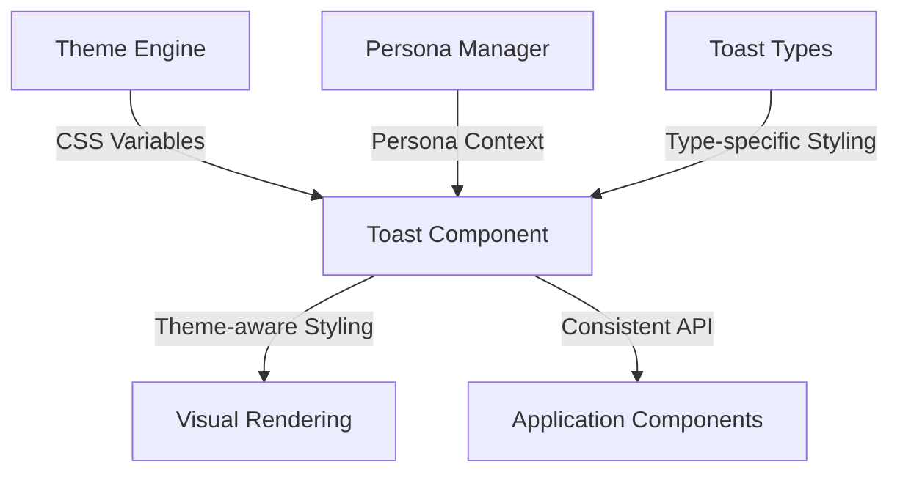

# Technical Design: Toast Component Redesign

## 1. Overview
This document outlines the technical design for redesigning the toast notification component to fully integrate with the theme engine system. The redesign focuses on leveraging CSS custom properties, improving visual consistency, and creating a more immersive notification experience that adapts to different themes and personas.

## 2. Architecture

### 2.1. Theme Integration Architecture
The toast component will be redesigned to fully utilize the theme engine's CSS custom properties system:



**Key Integration Points:**
- **CSS Variables**: All colors, glows, and surfaces use theme engine variables
- **Dynamic Theming**: Instant theme switching without component re-initialization
- **Persona Awareness**: Subtle styling variations based on active persona
- **Type System**: Enhanced type-specific styling using theme-appropriate colors

### 2.2. Component Architecture
The redesigned component maintains the existing API while enhancing internal implementation:

```typescript
interface ToastComponent {
  // Public API (unchanged for compatibility)
  show(message: string, type: ToastType, duration?: number): void;
  hide(): void;
  
  // Enhanced internal properties
  private _getThemeAwareStyles(): CSSResult;
  private _getPersonaAwareIcon(): string;
  private _getTypeSpecificGlow(): string;
}
```

## 3. Styling System

### 3.1. CSS Variable Integration
The component will use theme engine variables exclusively:

**Primary Variables:**
- `--cp-surface`, `--cp-surface-strong` - Background surfaces
- `--cp-surface-border`, `--cp-surface-border-2` - Border colors
- `--cp-text`, `--cp-muted` - Text colors
- `--cp-glow-cyan`, `--cp-glow-magenta`, `--cp-glow-purple` - Glow effects

**Type-Specific Color Mapping:**
- **Info**: Uses `--cp-cyan` and `--cp-glow-cyan`
- **Success**: Uses `--cp-green` and custom success glow
- **Warning**: Uses `--cp-amber` and custom warning glow  
- **Error**: Uses `--cp-red` and custom error glow

### 3.2. Glassmorphism Enhancement
Enhanced glassmorphism effects using theme variables:

```css
.toast {
  background: linear-gradient(135deg, 
    color-mix(in srgb, var(--cp-surface) 85%, transparent),
    color-mix(in srgb, var(--cp-surface-strong) 80%, transparent)
  );
  backdrop-filter: blur(12px) saturate(1.2);
  border: 1px solid color-mix(in srgb, var(--cp-surface-border) 60%, transparent);
  box-shadow: var(--toast-glow), 0 8px 32px rgba(0,0,0,0.2);
}
```

### 3.3. Dynamic Glow System
Type-specific glow effects that adapt to themes:

```css
:host {
  --toast-glow-info: var(--cp-glow-cyan);
  --toast-glow-success: 0 0 20px color-mix(in srgb, var(--cp-green) 40%, transparent);
  --toast-glow-warning: 0 0 20px color-mix(in srgb, var(--cp-amber) 40%, transparent);
  --toast-glow-error: 0 0 20px color-mix(in srgb, var(--cp-red) 40%, transparent);
}
```

## 4. Persona Integration

### 4.1. Persona-Aware Styling
Subtle styling variations based on active persona:

**VTuber Persona:**
- Slightly more rounded corners (`border-radius: 12px`)
- Enhanced glow effects for "cute" appeal
- Softer color transitions

**Assistant Persona:**
- Clean, professional appearance (`border-radius: 8px`)
- Minimal glow effects
- Sharp, precise styling

**Custom Personas:**
- Neutral styling that works with any theme
- Standard border radius and effects

### 4.2. Implementation Approach
```typescript
private _getPersonaStyles(): CSSResult {
  const persona = this.personaManager?.getActivePersona();
  switch (persona?.name) {
    case 'VTuber':
      return css`
        .toast { 
          border-radius: 12px; 
          --glow-intensity: 1.2;
        }
      `;
    case 'Assistant':
      return css`
        .toast { 
          border-radius: 8px; 
          --glow-intensity: 0.8;
        }
      `;
    default:
      return css`
        .toast { 
          border-radius: 10px; 
          --glow-intensity: 1.0;
        }
      `;
  }
}
```

## 5. Enhanced Animation System

### 5.1. Improved Animation Curves
Using more sophisticated easing for better feel:

```css
.toast {
  transition: all 400ms cubic-bezier(0.16, 1, 0.3, 1);
  transform: translateY(-24px) scale(0.95);
  opacity: 0;
}

.toast.visible {
  transform: translateY(0) scale(1);
  opacity: 1;
}
```

### 5.2. Stacking Animation
For multiple toasts:

```css
.toast:nth-child(n+2) {
  transform: translateY(calc(var(--toast-index) * 60px)) scale(calc(1 - var(--toast-index) * 0.05));
  opacity: calc(1 - var(--toast-index) * 0.2);
}
```

## 6. Icon System Enhancement

### 6.1. Theme-Aware Icons
Icons that adapt to theme colors:

```typescript
private _getThemedIcon(type: ToastType): TemplateResult {
  const iconColor = this._getIconColor(type);
  return html`
    <svg class="toast-icon" style="color: ${iconColor}">
      ${this._getIconPath(type)}
    </svg>
  `;
}

private _getIconColor(type: ToastType): string {
  switch (type) {
    case 'info': return 'var(--cp-cyan)';
    case 'success': return 'var(--cp-green)';
    case 'warning': return 'var(--cp-amber)';
    case 'error': return 'var(--cp-red)';
  }
}
```

## 7. Performance Optimizations

### 7.1. Hardware Acceleration
Ensure smooth animations:

```css
.toast {
  will-change: transform, opacity;
  transform: translateZ(0); /* Force hardware acceleration */
}
```

### 7.2. Efficient DOM Management
- Reuse toast elements when possible
- Clean up DOM nodes after animations complete
- Use CSS containment for better performance

## 8. Accessibility Enhancements

### 8.1. ARIA Support
```html
<div 
  class="toast" 
  role="alert" 
  aria-live="polite"
  aria-atomic="true"
>
  <span class="toast-icon" aria-hidden="true">${icon}</span>
  <span class="toast-message">${message}</span>
</div>
```

### 8.2. Reduced Motion Support
```css
@media (prefers-reduced-motion: reduce) {
  .toast {
    transition: opacity 200ms ease;
    transform: none;
  }
}
```

## 9. Integration Points

### 9.1. Theme Engine Dependencies
- Requires theme engine CSS variables to be loaded
- Listens for theme change events for dynamic updates
- Falls back gracefully if theme variables are unavailable

### 9.2. Persona Manager Integration
- Optional integration with PersonaManager for persona-aware styling
- Graceful degradation if PersonaManager is unavailable
- Event-driven updates when persona changes

## 10. Migration Strategy

### 10.1. Backward Compatibility
- Maintain existing public API
- Preserve existing toast types and behavior
- Ensure existing usage patterns continue to work

### 10.2. Progressive Enhancement
- Enhanced styling applies automatically with theme engine
- Persona awareness activates when PersonaManager is available
- Fallback to current behavior if dependencies are missing

## 11. Testing Strategy

### 11.1. Visual Testing
- Test across all available themes
- Verify persona-specific styling variations
- Ensure proper contrast ratios in all combinations

### 11.2. Functional Testing
- Test animation performance across devices
- Verify accessibility features
- Test multiple toast stacking behavior

### 11.3. Integration Testing
- Test theme switching with visible toasts
- Test persona switching with visible toasts
- Verify proper cleanup and memory management