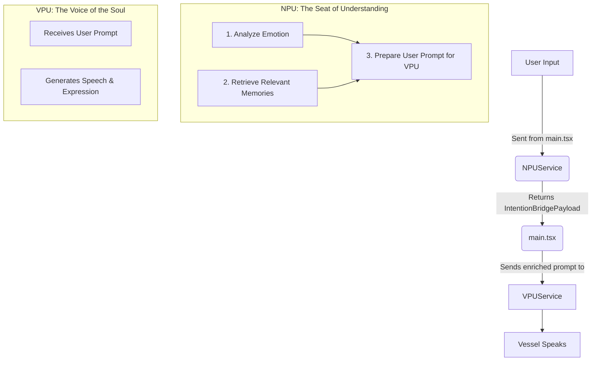

# Unified Cognitive Architecture v1: Design

## 1. Overview

This document outlines the technical design for the Unified Cognitive Architecture. The goal is to refactor the existing system to eliminate diffuse, multi-call processing and introduce a streamlined, single-call architecture that unifies memory retrieval, emotional analysis, and prompt generation.

This new architecture will resolve the "silent vessel" issue by ensuring a clear, unbroken flow of intent from the user to the AI's expressive voice. It introduces a well-defined "Intention Bridge" between the Neural Processing Unit (NPU) and the Vocal Processing Unit (VPU), preventing any distortion of the user's original message while enriching it with vital context.

## 2. Architecture

This version unifies and subsumes the prior Core Memory System v1 retrieval flow while keeping its proven practices. Memory storage remains asynchronous and non-blocking; retrieval is integrated directly into the NPU’s single-call cognition.


The new architecture follows a simple, linear flow. The `main.tsx` component will orchestrate the process, calling a single, powerful method in the `NPUService`. This service will handle all complex analysis and return a structured payload for the `VPUService` to act upon.



## 3. Components and Interfaces

- Proven practices from Core Memory System v1 carried forward:
  - Contextual Memory Retrieval: semantic similarity search via VectorStore on each user turn; subtle use in prompts; never expose raw memory source.
  - TTS-only integration: memory-enriched flow applies to text chat; calls may use separate delta-emotion logic.
  - Graceful fallback: if retrieval or parsing fails, forward original user input to prevent silent failure.


### 3.1. `features/ai/NPUService.ts`

The `NPUService` will be refactored to be the central point of cognitive processing.

*   **Remove:** `createRAGPrompt()` - This logic will be merged.
*   **Remove:** `analyzeUserInputEmotion()` - This logic will be merged.
*   **Add:** `public async analyzeAndAdvise(userInput: string, memories: Memory[]): Promise<IntentionBridgePayload>`
    *   This will be the new, primary method.
    *   It will internally call the Gemini API once with a sophisticated prompt that instructs the model to perform all necessary analysis and return a single, structured JSON object matching the `IntentionBridgePayload` interface.
    *   It will be responsible for parsing the model's response and ensuring it conforms to the required structure.

### 3.2. `features/vpu/VPUService.ts`

The `VPUService` will be simplified. Its role is purely to vocalize.

*   No new methods are required. It will simply receive the `rag_prompt_for_vpu` from the `IntentionBridgePayload` and process it.

## 4. Data Models

Memory retrieval and usage guidelines (from Core Memory v1):
- Retrieval: perform a semantic search for top-K (default 5) memories with a relevance threshold (default 0.7). Prefer caching within a short TTL.
- Formatting: present retrieved memories to the NPU as an internal context string; do not expose to the VPU directly.
- Subtlety: the context provided to the NPU must not be mentioned in the VPU's final response.


The "Intention Bridge" is the most critical data structure in this design. It ensures a lossless transfer of context and intent.

```typescript
// in features/ai/NPUService.ts or a shared types file

/**
 * The structured payload returned by the NPU after analyzing user input.
 * This serves as the "Intention Bridge" to the VPU.
 */
export interface IntentionBridgePayload {
  /**
   * The primary emotion detected in the user's input.
   */
  emotion: 'joy' | 'sadness' | 'anger' | 'fear' | 'surprise' | 'neutral' | 'curiosity';

  /**
   * The model's confidence in the detected emotion, from 0.0 to 1.0.
   */
  emotion_confidence: number;

  /**
   * The final, structured prompt to be sent to the VPU.
   * This is not just a string, but a carefully constructed set of instructions.
   */
  rag_prompt_for_vpu: string;
}
```

The `rag_prompt_for_vpu` is the user's verbatim input. The VPU uses this as the query for its RAG-based response generation.

1.  **Relevant Memories:** (e.g., "REMEMBER: The user enjoys discussing philosophy.")
2.  **Perceived Intent:** (e.g., "INTENT: The user seems curious and wants a deeper explanation.")
3.  **Original Message:** (The user's raw, unmodified input text.)

## 5. Error Handling

- NPU single-call retry with exponential backoff (3 attempts; 400ms, 800ms).
- JSON parsing: strip markdown fences and recover gracefully; on failure, default to neutral emotion and pass through the original user input.
- Memory retrieval failure: do not block the flow; proceed without context.
- Conversation context: optional; if provided, it is included in the unified prompt; absence should not degrade behavior.


*   The `analyzeAndAdvise` method must be wrapped in a `try...catch` block.
*   If the Gemini API call fails, it should be retried with exponential backoff.
*   If the response is not valid JSON or does not match the `IntentionBridgePayload` interface after stripping markdown, the method will **not** throw an error. Instead, it will gracefully fall back.
*   In a fallback scenario, the `analyzeAndAdvise` method will construct a "default" `IntentionBridgePayload`.
    *   `emotion` will be set to `"neutral"`.
    *   `emotion_confidence` will be set to `0.5`.
    *   `rag_prompt_for_vpu` will simply be the original, unmodified `userInput`.
*   This ensures that even if the NPU's complex analysis fails, the VPU still receives a valid prompt, preventing the "silent vessel" issue and allowing the conversation to continue.

## 6. Testing Strategy

*   **Unit Tests:**
    *   A new test file for `NPUService.ts` will be created.
    *   It will mock the Gemini API response and test the `analyzeAndAdvise` method's ability to correctly parse valid JSON.
    *   It will test the method's resilience to invalid or malformed JSON, ensuring it throws the correct errors.
*   **Integration Tests:**
    *   An integration test will be created to verify the full flow from `main.tsx` -> `NPUService.ts` -> `VPUService.ts`. This will ensure the `IntentionBridgePayload` is passed and interpreted correctly between the services.